# 4Sports — Schema v4 · Diagramas por módulo

> PostgreSQL 16 · Drizzle ORM · BetterAuth
> Cada diagrama cubre un módulo funcional con sus campos principales.

---

## Módulo 1 — Identidad

BetterAuth genera `user`, `session`, `account` y `verification` automáticamente. Nosotros extendemos con `profiles`. Un usuario puede pertenecer a múltiples organizaciones con roles distintos en cada una.

- **profiles** — extiende `user` de BetterAuth con datos de negocio. `initial_intent` registra si el usuario se registró como jugador u organizador. `onboarding_completed_at` permite reanudar el asistente si lo abandona a mitad.
- **organizations** — entidad raíz de cada liga o complejo deportivo. Incluye los campos de pasarela de pago (`gateway_type`, `gateway_account_id`) para cobros digitales.
- **organization_members** — tabla pivote entre usuarios y organizaciones. `role` define los permisos dentro de esa organización. `invitation_expires_at` cierra invitaciones abiertas indefinidamente. `tournament_ids[]` restringe el scope del organizador local a torneos específicos.

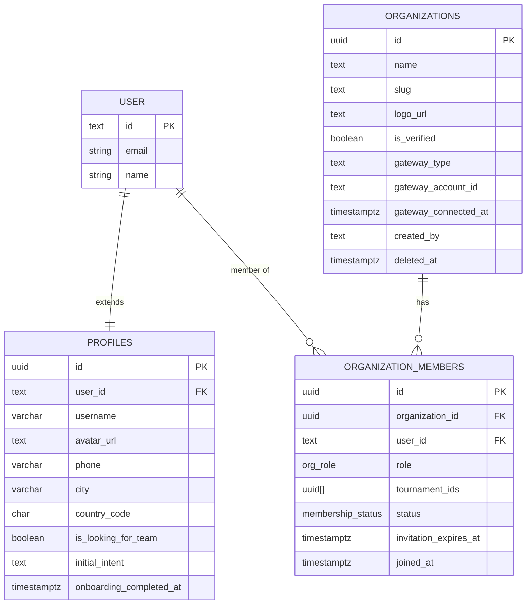

---

## Módulo 2 — Deportes y formatos

Catálogos base de la plataforma. `sports.metadata` almacena los defaults de tiebreakers, sistema de puntos y métricas base por deporte. `tournament_formats` define qué tipos de competición están disponibles y qué estructuras soportan.

- **sports** — catálogo de deportes disponibles. `metadata` contiene tiebreakers por default, puntos por victoria/empate/derrota y métricas base.
- **sport_positions** — posiciones base por deporte (portero, delantero, base, alero). El organizador puede agregar posiciones custom en su torneo.
- **tournament_formats** — formatos disponibles: `round_robin`, `single_elimination`, `double_elimination`, `world_cup`. Define qué estructuras soporta cada formato.

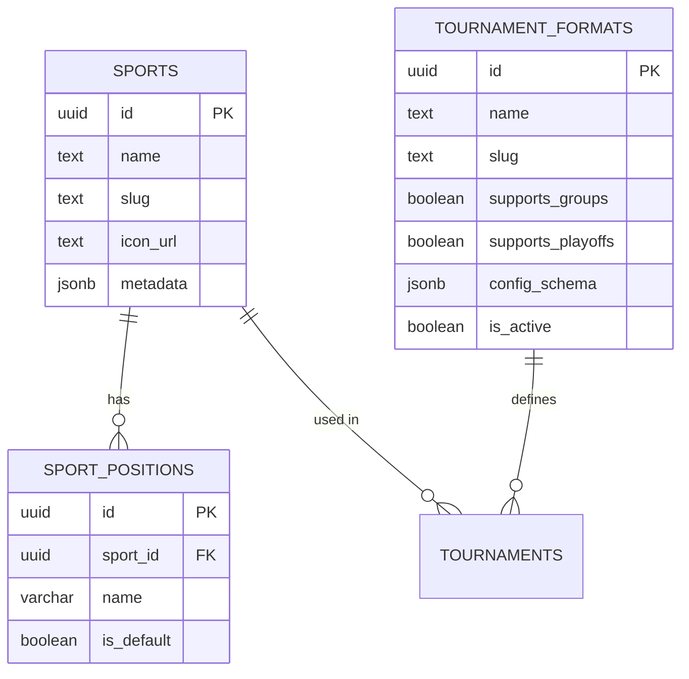

---

## Módulo 3 — Torneos

El corazón del producto. `tournaments` concentra toda la configuración del torneo. `settings` JSONB almacena: sistema de puntos, tiebreakers, walkover_score, dispute_window_hours, financial_tolerance y transfer_window. `created_under_plan` se estampa al publicar y garantiza el ciclo de vida protegido.

- **tournaments** — entidad principal. `wizard_step` permite reanudar el asistente de creación. `tags[]` son etiquetas de contexto (Femenil, Sub-17) para filtros dinámicos. `override_billing_account` activa la pasarela propia del torneo en lugar de heredar la de la organización.
- **tournament_metrics** — métricas configurables por torneo. `forces_game_ejection` bloquea al jugador en tiempo real. `suspension_matches` es la sanción sugerida por default para ese tipo de evento.
- **tournament_categories** — categorías opcionales dentro de un torneo (Sub-17, Femenil). Las restricciones de elegibilidad viven en las reglas del torneo, no en las categorías.

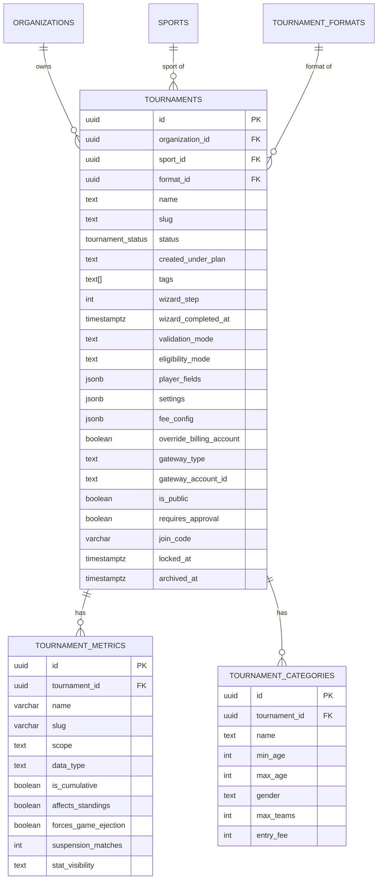

---

## Módulo 4 — Canchas

Ownership progresivo: una cancha nace como `tournament_scoped` y puede escalar a `organization_scoped` o `verified_global`. `tournament_venues` vincula las canchas disponibles en un torneo específico.

- **venues** — canchas y espacios deportivos. `scope` controla a quién pertenece la cancha. `verification_status` es el proceso de validación por parte de 4Sports.
- **tournament_venues** — tabla pivote: qué canchas están disponibles en cada torneo.

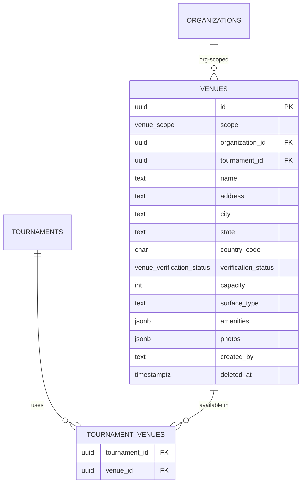

---

## Módulo 5 — Equipos y jugadores

Ownership progresivo en equipos: `tournament_scoped` → `organization_scoped` → `verified_global`. Los jugadores pueden ser usuarios reales (`user_id` presente) o perfiles puente (`is_guest = true`). La vinculación de identidad nunca ocurre automáticamente.

- **teams** — equipo deportivo. `join_policy` define cómo se ingresa: open, request, invite_only o code. `scope` controla la visibilidad y ownership del equipo.
- **players** — jugador real o perfil puente. `is_guest = true` indica que fue creado por el capitán sin que el jugador tenga cuenta. `CONSTRAINT chk_player_identity` garantiza que siempre tenga `user_id` o sea guest.
- **team_members** — membresía de un jugador en un equipo. `join_type` registra cómo ingresó (directo, invitación, solicitud, transferencia, token). `transfer_approved_by` registra quién autorizó la transferencia regulada.

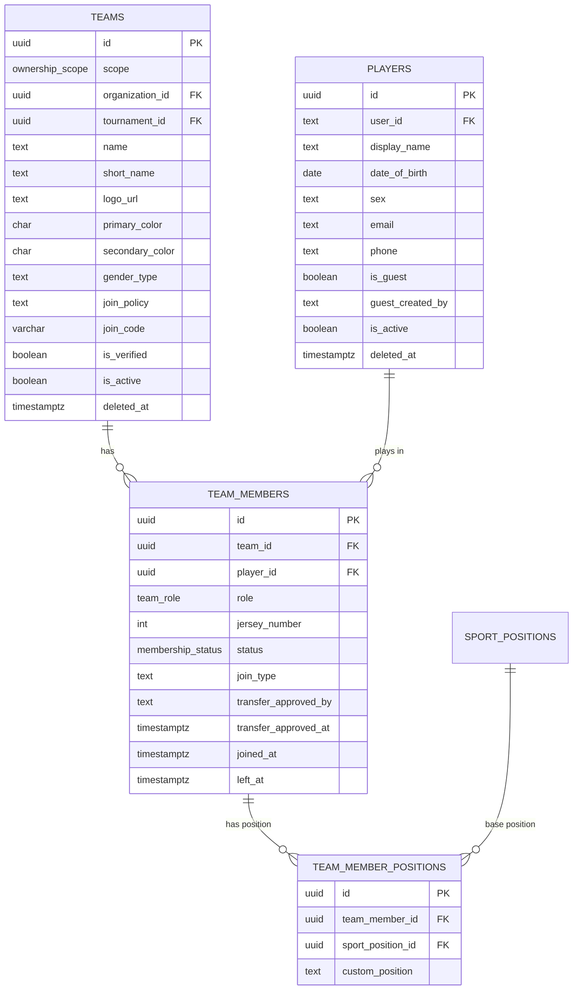

---

## Módulo 6 — Invitaciones y tokens

Tres mecanismos de acceso sin cuenta completa: invitaciones por email, solicitudes de ingreso y tokens de capitán. Todos son de un solo uso o tienen expiración configurable.

- **team_invitations** — invitación formal a un equipo. Puede ir a un `user_id` existente o a un email. `tournament_id` permite invitaciones en el contexto de un torneo específico para validar elegibilidad.
- **team_join_requests** — solicitud iniciada por el jugador en equipos con `join_policy = request`. El capitán la aprueba o rechaza.
- **captain_invite_tokens** — link de capitán que permite gestionar un equipo sin cuenta completa. `is_used = true` al consumirse.

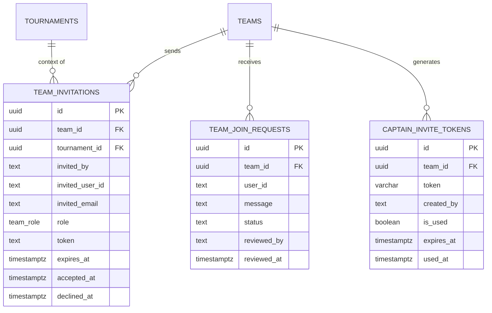

---

## Módulo 7 — Inscripciones

Vincula equipos con torneos. `financial_hold` bloquea al equipo en la cédula arbitral cuando supera el límite de deuda configurado. `seed` se usa para la distribución de grupos en Modo Mundial.

- **tournament_registrations** — inscripción de un equipo en un torneo. `status` va de `pending` → `approved` o `rejected`. `financial_hold` es el bloqueo operativo por deuda, distinto del estado de inscripción.

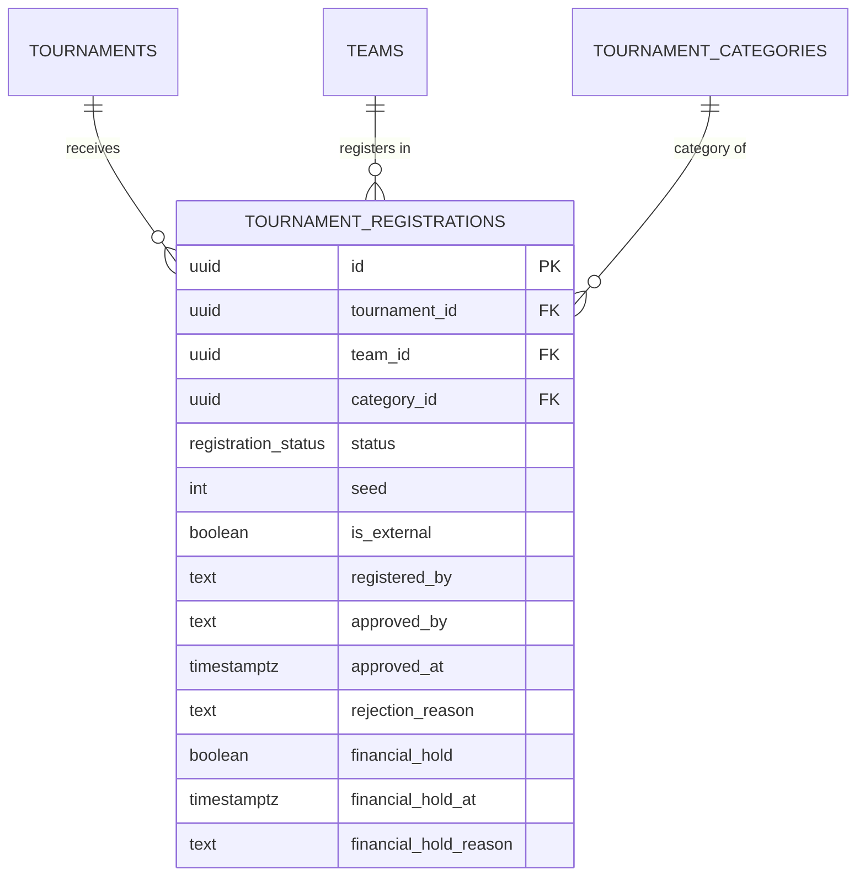

---

## Módulo 8 — Estructura del torneo (stages y brackets)

Jerarquía de estructura competitiva. Un torneo tiene stages → cada stage tiene grupos o brackets → cada bracket tiene rounds → cada round tiene matches. `transition_status` controla el estado de validación manual entre Fase de Grupos y Playoffs.

- **stages** — fase del torneo (Fase de Grupos, Cuartos, Semifinal, Final). `transition_status` registra si la transición a playoffs está pendiente de validación del organizador.
- **groups** — grupos dentro de una stage de tipo `groups`. `group_teams` asocia los equipos a cada grupo con su seed.
- **brackets** — árbol de eliminación. `bracket_type` distingue entre ganadores, perdedores y gran final (double elimination).
- **rounds** — jornada o ronda dentro de un bracket o stage. `best_of` define el formato de la serie.

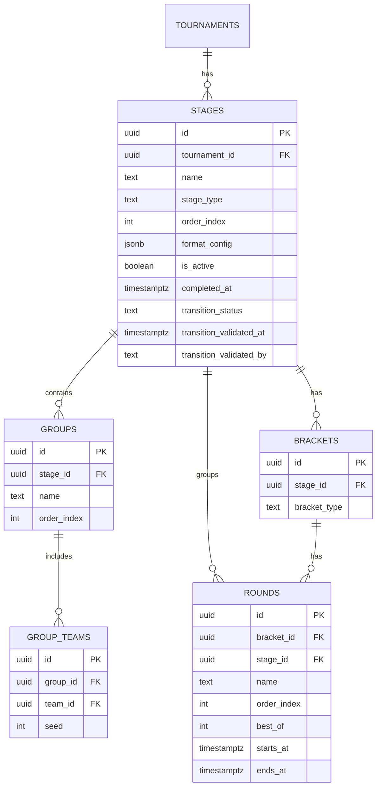

---

## Módulo 9 — Partidos

La tabla más compleja del schema. `status` incluye `pending_review` (capitán reportó sin árbitro) y `disputed` (resultado en disputa activa). `next_match_id` encadena el ganador al siguiente partido del bracket. `captured_by` y `capture_role` registran quién capturó los eventos para auditoría.

- **matches** — partido individual. `loser_next_match_id` es para double elimination. `referee_session_token` permite árbitros externos sin cuenta. `captured_by` registra el actor que capturó los eventos (árbitro, organizador, capitán).
- **match_results** — resultados por período (1er Tiempo, Set 1, OT, Penales).
- **match_assignments** — árbitros y staff asignados a un partido con su rol específico.
- **match_convocatorias** — respuestas de asistencia al partido por jugador (Voy / No voy / Duda).
- **match_lineups** — alineación táctica publicable. `lineup_role` distingue titular, suplente o no jugó.
- **match_disputes** — formulario formal de disputa de resultado con evidencia adjunta.

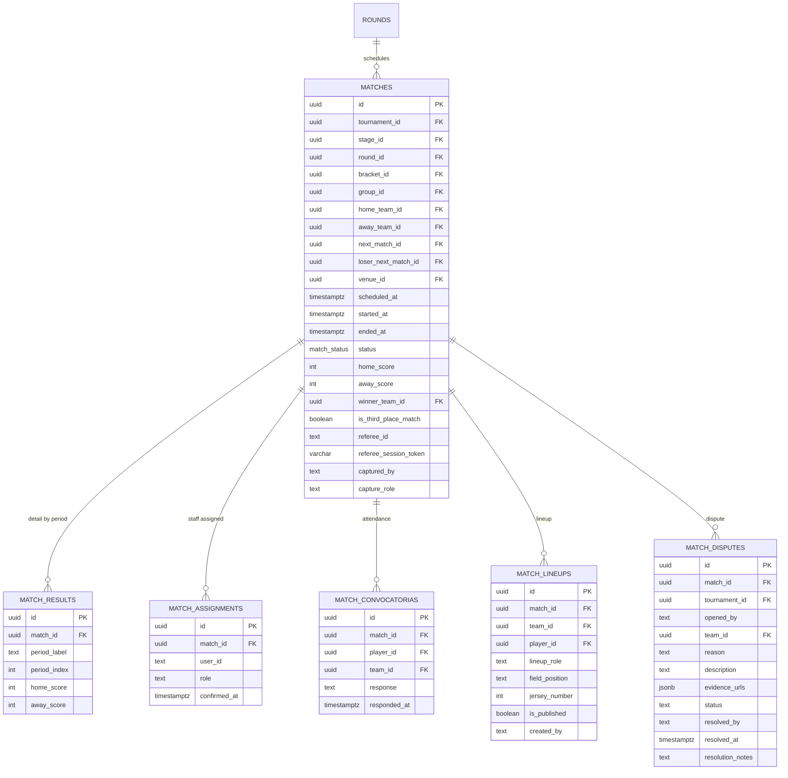

---

## Módulo 10 — Estadísticas

`player_stat_values` y `team_stat_values` registran cada evento del partido. `is_draft = true` indica que el evento fue registrado post-partido y aún no ha impactado standings. `minute = null` es válido para eventos sin minuto exacto. `player_suspensions` encapsula las suspensiones por organización — nunca son globales.

- **player_stat_values** — estadística individual por partido. `is_draft` controla el borrador post-partido. `period_index` referencia el período para eventos sin minuto exacto.
- **team_stat_values** — estadística de equipo por partido. Misma mecánica de borrador.
- **standings** — tabla de posiciones calculada al vuelo — no almacena el rank fijo. `extra_stats` JSONB almacena goles a favor, en contra, diferencia de goles, sets ganados, etc.
- **player_suspensions** — suspensiones activas con alcance por organización. `matches_served` rastrea cuántos partidos ya cumplió el jugador suspendido.

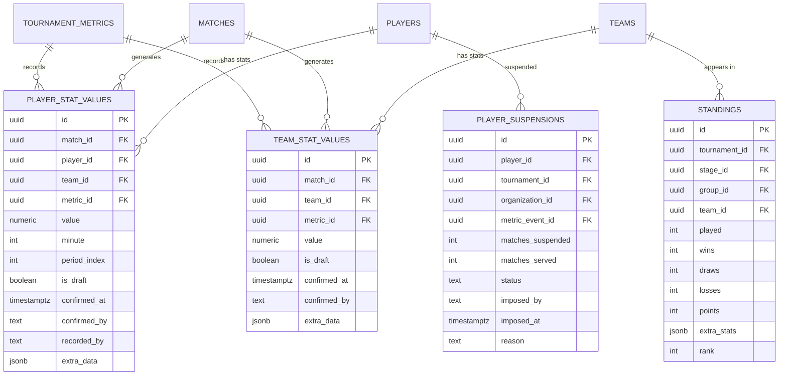

---

## Módulo 11 — Pagos

Flujo: `tournament_fee_items` define los conceptos de cobro → `fee_invoices` genera la deuda automáticamente al cumplirse el trigger → `payment_records` registra cada pago (parcial o total). `payment_webhooks` previene procesamiento duplicado con `UNIQUE (gateway, external_ref)`.

- **tournament_fee_items** — conceptos de cobro del torneo (inscripción, arbitraje, credenciales). `min_partial_payment` define el monto mínimo de abono.
- **fee_invoices** — deuda generada automáticamente. `total_amount` se congela al crear — nunca se recalcula si el organizador cambia el precio del fee_item.
- **payment_records** — cada pago registrado. Puede ser parcial. `is_online` distingue efectivo de pago digital. `status = processing` es el estado transitorio mientras llega el webhook.
- **payment_webhooks** — registro de webhooks recibidos de Stripe / Mercado Pago. Cubre tanto pagos de torneos como cobros de suscripción SaaS.

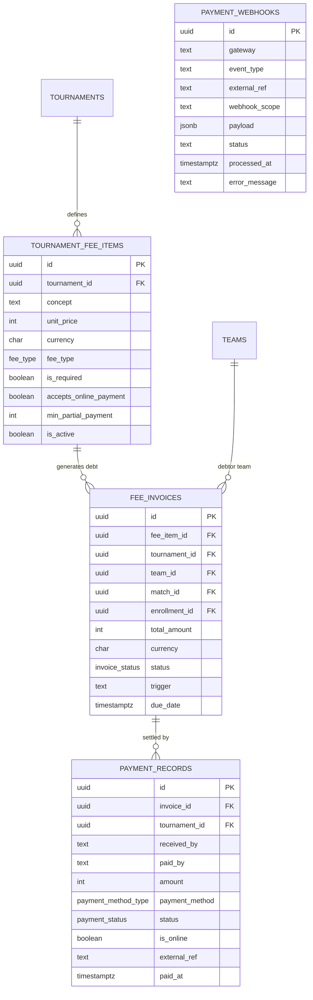

---

## Módulo 12 — Suscripciones SaaS

`subscription_plans.features` JSONB define qué tiene cada plan. `organizer_subscriptions` rastrea el ciclo de vida completo incluyendo downgrades pendientes y razones de abort. `subscription_plan_history` reconstruye el historial completo de cambios de plan.

- **subscription_plans** — catálogo de planes: free, starter, pro, elite. `features` JSONB contiene todos los feature flags y límites del plan.
- **organizer_subscriptions** — suscripción activa de la organización. `pending_plan_id` registra un downgrade pendiente hasta el fin del ciclo. `last_downgrade_abort_reason` documenta por qué el sistema abortó un downgrade automáticamente.
- **feature_overrides** — ajustes manuales de features por organización. Tienen prioridad máxima sobre el plan. Pueden habilitar o deshabilitar features independientemente.
- **subscription_plan_history** — historial completo de cambios de plan para auditoría.

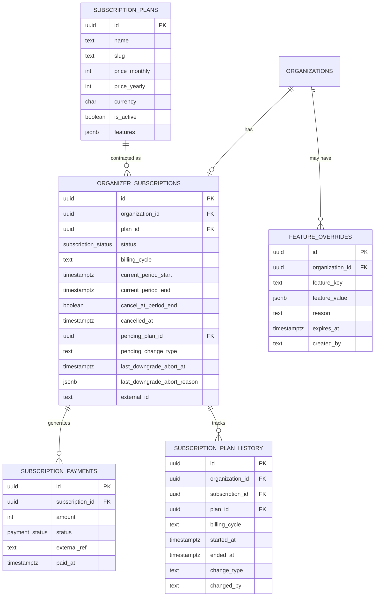

---

## Módulo 13 — Notificaciones

Dos categorías de notificaciones: inmutables (dictadas por la liga, no se pueden silenciar) y personalizables (el usuario controla). `notification_types` es el catálogo que define si cada tipo es mutable o no. `is_public` habilita el tablón de anuncios visible para fanáticos anónimos.

- **notification_types** — catálogo de tipos con `is_mutable`. `false` = la liga la dicta, el usuario no puede silenciarla. El backend rechaza cualquier intento de modificarla con 403.
- **notifications** — notificación individual. `is_public` la hace visible en el tablón público del torneo. `announcement_type` distingue comunicados manuales de los generados automáticamente por cambios post-publicación.
- **notification_preferences** — preferencias del usuario por tipo y canal. Solo aplica a tipos mutables.
- **notification_deliveries** — registro de entrega por canal. `attempt_count` y `max_attempts` controlan los reintentos de BullMQ.
- **fcm_tokens** — tokens de Firebase por dispositivo. `platform` distingue iOS, Android y web.

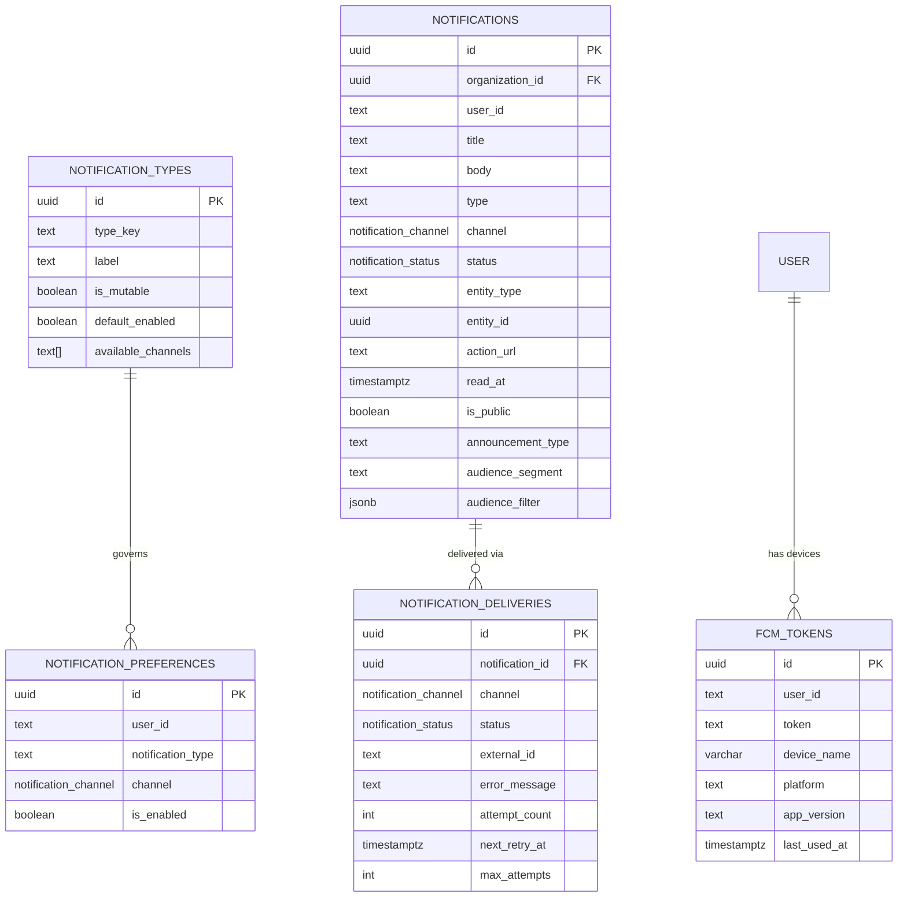

---

## Módulo 14 — Auditoría

Registro completo e inmutable de todas las operaciones críticas. `audit_logs` es append-only — no se actualiza ni elimina. `entity_history` almacena snapshots completos de entidades en versiones sucesivas.

- **audit_logs** — registro de cada acción crítica con datos antes/después y diff. `actor_role` captura el rol con el que actuó el usuario en ese momento.
- **entity_history** — snapshots versionados de entidades críticas. Permite reconstruir el estado exacto de un torneo o partido en cualquier punto del tiempo.

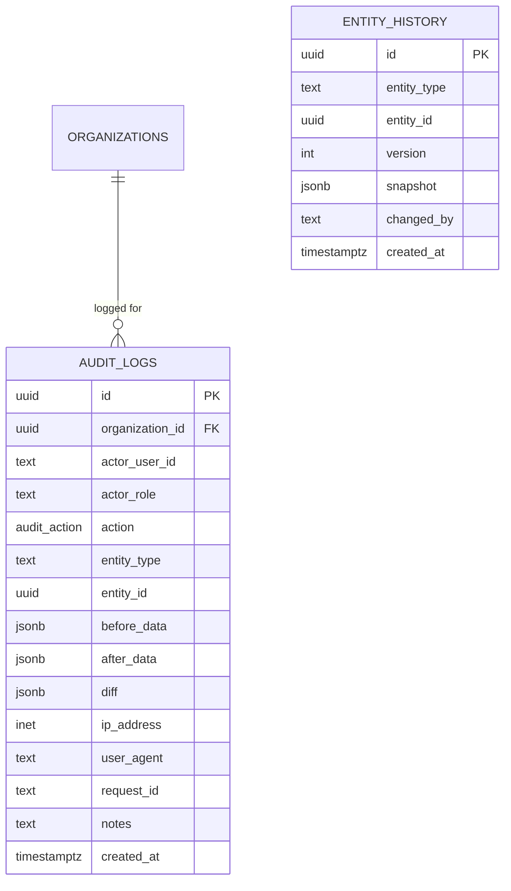

---

## Resumen de tablas nuevas en v4

| Tabla | Módulo | Resuelve |
|---|---|---|
| `match_convocatorias` | Partidos | Respuestas de asistencia por jugador |
| `match_lineups` | Partidos | Alineaciones tácticas publicables |
| `match_disputes` | Partidos | Formulario formal de disputa |
| `player_suspensions` | Estadísticas | Suspensiones encapsuladas por organización |
| `payment_webhooks` | Pagos | Previene webhooks duplicados |
| `subscription_plan_history` | Suscripciones | Historial completo de cambios de plan |
| `notification_types` | Notificaciones | Catálogo con `is_mutable` para gobernanza |
