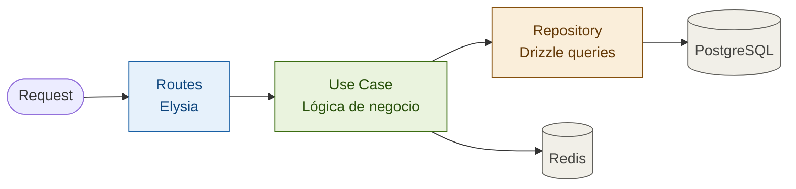
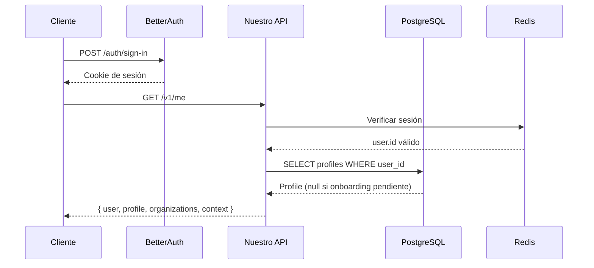
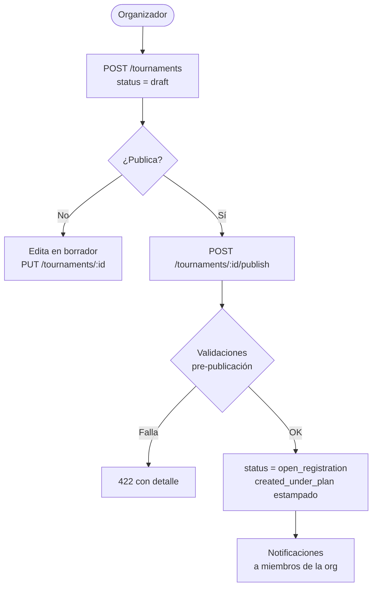
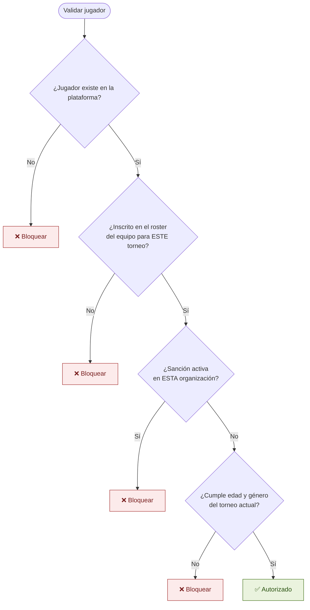
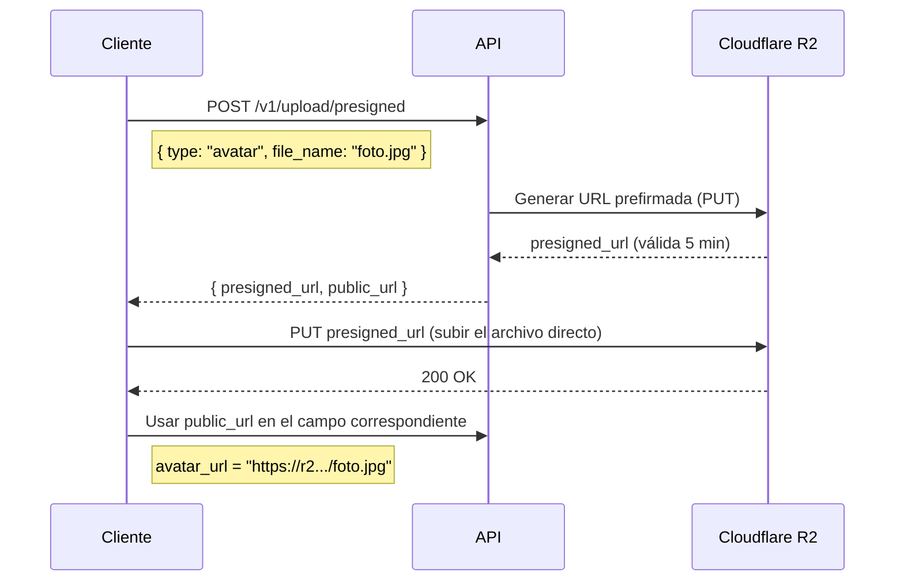

# 4Sports — Documento Técnico del Equipo
## Hitos 1 y 2: Autenticación, Roles, Torneos y Equipos

> Para: Alexis, Josue, Garib, Ivan
> Complementa el PRD — este documento es sobre **cómo se construye**, no sobre qué se construye.
> El schema completo vive en `schema_v4.sql`. Los casos de uso detallados están en los bloques de UC.

---

## Cómo leer este documento

Cada sección tiene tres partes:

- **Endpoints** — qué rutas existen, qué reciben y qué regresan. Sin jerga de Swagger.
- **Reglas del backend** — validaciones, lógica de negocio y casos especiales que el servicio debe manejar.
- **Contrato del frontend** — qué datos necesita cada pantalla y en qué formato los espera.

---

## Stack de referencia rápida

| Capa | Tecnología | Nota |
|---|---|---|
| Runtime | Bun | Todo corre sobre Bun — no Node |
| API | ElysiaJS | REST + WebSockets nativos |
| ORM | Drizzle | SQL-first, sin magic |
| Auth | BetterAuth | Genera sus propias tablas — no tocar |
| Base de datos | PostgreSQL 16 | Schema v4 |
| Caché / Sesiones | Redis | Contexto activo del usuario aquí |
| Archivos | Cloudflare R2 | Logos, banners, PDFs, evidencias |
| Push | Firebase FCM | Notificaciones mobile |

---

## Arquitectura de la API

La API sigue capas estrictas. **Las capas no se mezclan.**



**Regla:** las rutas solo llaman a casos de uso. Los casos de uso solo llaman a repositorios. Los repositorios solo hacen queries con Drizzle. Si algo necesita Redis, lo maneja el caso de uso — nunca la ruta ni el repositorio.

---

## Estructura de módulos

```
apps/api/src/
├── v1/
│   └── index.ts                 ← agrega todas las rutas bajo /v1
├── modules/
│   ├── auth/                    ← /v1/me, /v1/context
│   │   ├── auth.entity.ts       ← tipo de dominio
│   │   ├── auth.repository.ts   ← interface
│   │   ├── drizzle-auth.repository.ts ← impl Drizzle
│   │   ├── errors/
│   │   │   ├── codes.ts
│   │   │   └── index.ts
│   │   ├── http/v1/
│   │   │   ├── routes.ts
│   │   │   ├── schemas.ts       ← validación TypeBox
│   │   │   └── docs.ts          ← OpenAPI
│   │   └── use-cases/
│   │       ├── get-me.use-case.ts
│   │       └── set-context.use-case.ts
│   ├── onboarding/              ← /v1/onboarding/player|organizer, /v1/check-username|slug
│   │   ├── onboarding.entity.ts
│   │   ├── onboarding.repository.ts
│   │   ├── drizzle-onboarding.repository.ts
│   │   ├── errors/
│   │   ├── http/v1/
│   │   │   ├── routes.ts
│   │   │   ├── schemas.ts
│   │   │   └── docs.ts
│   │   └── use-cases/
│   └── organizations/           ← /v1/organizations/:orgId[/members]
│       ├── organization.entity.ts
│       ├── organization.repository.ts
│       ├── drizzle-organization.repository.ts
│       ├── errors/
│       ├── http/v1/
│       │   ├── routes.ts
│       │   ├── schemas.ts
│       │   └── docs.ts
│       └── use-cases/
├── shared/
│   ├── api-response.ts          ← formato estándar de respuesta
│   ├── env.ts                   ← variables de entorno
│   ├── logger.ts                ← instancia de log
│   ├── versioning.ts            ← prefijo /v{N}
│   ├── middleware/
│   │   ├── auth.guard.ts        ← valida sesión BetterAuth
│   │   ├── org.guard.ts         ← valida scope de organización
│   │   ├── feature.guard.ts     ← valida feature del plan
│   │   └── request-logger.ts    ← requestId + log de duración
│   ├── db/
│   │   ├── client.ts            ← instancia Drizzle
│   │   ├── redis.ts             ← instancia Redis
│   │   ├── schemas/             ← tablas Drizzle (profiles, organizations, ...)
│   │   └── seeds/               ← datos iniciales (planes, permisos, ...)
│   ├── lib/
│   │   └── auth.ts              ← configuración BetterAuth
│   └── openapi/
│       └── responses.ts         ← helpers OpenAPI
└── index.ts
```

---

## Convenciones de la API

### URLs

```
/v1/{recurso}
/v1/{recurso}/{id}
/v1/{recurso}/{id}/{sub-recurso}
```

Ejemplos:
```
GET  /v1/organizations
GET  /v1/organizations/:orgId/tournaments
POST /v1/tournaments/:tournamentId/teams
```

### Formato de respuesta — siempre el mismo

**Éxito:**
```json
{
  "data": { ... },
  "meta": { "page": 1, "total": 42 }
}
```

**Error:**
```json
{
  "error": {
    "code": "TEAM_NOT_ELIGIBLE",
    "message": "El equipo no cumple las reglas de género del torneo.",
    "details": { "field": "gender_type", "expected": "female", "received": "mixed" }
  }
}
```

### Códigos de error más usados

| Código HTTP | Cuándo |
|---|---|
| 400 | Datos inválidos en el body |
| 401 | Sin sesión activa |
| 403 | Sin permisos para esa operación |
| 404 | Recurso no encontrado |
| 409 | Conflicto — ya existe (slug duplicado, usuario ya es miembro) |
| 422 | Validación de negocio falla (equipo no elegible, plan insuficiente) |

### Autenticación

Todas las rutas protegidas requieren la cookie de sesión de BetterAuth. El middleware `auth.guard.ts` valida la sesión en Redis y adjunta el `user` al contexto de la request.

Las rutas públicas (ver torneo, ver tabla de posiciones) no requieren sesión pero pueden recibir contexto limitado si hay sesión activa.

---

## Hito 1 — Autenticación y roles

### Flujo de autenticación

BetterAuth maneja el flujo completo de email/contraseña y OAuth. Lo que **nosotros** construimos es lo que pasa después de que BetterAuth confirma la identidad.



---

### Endpoints — Auth y perfil

#### `GET /v1/me`
Retorna el usuario actual con su perfil, organizaciones activas y contexto seleccionado.

**Requiere:** sesión activa.

**Respuesta:**
```json
{
  "data": {
    "user": { "id": "...", "email": "...", "name": "..." },
    "profile": {
      "username": "alexis_mx",
      "avatar_url": "https://r2.../avatar.jpg",
      "city": "Hermosillo",
      "initial_intent": "organizer",
      "onboarding_completed_at": "2025-06-01T..."
    },
    "organizations": [
      { "id": "...", "name": "Liga Verano", "role": "owner", "slug": "liga-verano" }
    ],
    "active_context": {
      "organization_id": "...",
      "role": "owner"
    }
  }
}
```

**Reglas del backend:**
- Si `profile` es `null`: el usuario no completó el onboarding. El cliente debe redirigir al flujo de onboarding.
- `active_context` viene de Redis. Si no existe en Redis (primera sesión), el backend lo calcula: si tiene 1 org → selecciona automáticamente. Si tiene 0 orgs → contexto de jugador. Si tiene 2+ orgs → retorna `null` y el cliente muestra el selector.

---

#### `POST /v1/onboarding/player`
Completa el onboarding del jugador.

**Body:**
```json
{
  "username": "carlos_delantero",
  "city": "Hermosillo",
  "country_code": "MX",
  "phone": "+526621234567",
  "is_looking_for_team": true
}
```

**Reglas del backend:**
- `username` único global — validar contra `profiles.username` antes de insertar.
- Si `username` está tomado: `409` con sugerencias de variantes (`carlos_delantero_2`).
- Al completar: `profiles.onboarding_completed_at = NOW()`, `initial_intent = 'player'`.

---

#### `POST /v1/onboarding/organizer`
Completa el onboarding del organizador en un solo request. Crea perfil + organización + membership + suscripción.

**Body:**
```json
{
  "profile": {
    "username": "alexis_liga",
    "city": "Hermosillo",
    "country_code": "MX"
  },
  "organization": {
    "name": "Liga Verano Hermosillo",
    "slug": "liga-verano-hermosillo",
    "city": "Hermosillo",
    "country_code": "MX"
  },
  "plan": "free"
}
```

**Reglas del backend:**
- Todo en una transacción atómica. Si algo falla, se hace rollback completo.
- Orden: crear `profiles` → crear `organizations` → crear `organization_members` (owner) → crear `organizer_subscriptions`.
- Si `slug` ya existe: `409`. El cliente debe ofrecer variantes.
- `plan` acepta: `free`, `starter`, `pro`, `elite`. Si es de pago, se requiere `payment_token` adicional.
- Al completar: `profiles.onboarding_completed_at = NOW()`, `initial_intent = 'organizer'`.

---

#### `PUT /v1/context`
Cambia la organización activa del usuario (selector de contexto).

**Body:**
```json
{ "organization_id": "uuid-de-la-org" }
```

**Reglas del backend:**
- Validar que el usuario es miembro activo de esa organización.
- Guardar en Redis: `context:{user_id}` = `{ organization_id, role }`.
- Si `organization_id = null`: contexto de jugador.

---

### Endpoints — Organizaciones y miembros

#### `GET /v1/organizations/:orgId`
Retorna la organización y el rol del usuario en ella.

**Reglas del backend:**
- Solo miembros activos pueden ver la organización.
- `403` si el usuario no es miembro.

---

#### `POST /v1/organizations/:orgId/members`
Invita a un nuevo miembro.

**Requiere:** rol `owner` o `admin` en la organización.

**Body:**
```json
{
  "email": "josue@ejemplo.com",
  "role": "organizer",
  "tournament_ids": ["uuid-torneo-1"]
}
```

**Reglas del backend:**
- Si el email ya es miembro activo: `409`.
- Si el email ya tiene invitación pendiente: ofrecer reenvío, no crear duplicado.
- Un `admin` no puede invitar a `owner` ni a otro `admin` — `403`.
- Si `role = 'organizer'`: `tournament_ids` es requerido.
- `invitation_expires_at = NOW() + 7 days`.

---

#### `PUT /v1/organizations/:orgId/members/:memberId`
Cambia el rol de un miembro.

**Requiere:** rol `owner` o `admin`.

**Body:**
```json
{ "role": "admin", "tournament_ids": [] }
```

**Reglas del backend:**
- No se puede degradar al único `owner` de la organización.
- Un `admin` no puede promover a `owner` ni a otro `admin`.
- Registrar en `audit_logs`.

---

#### `DELETE /v1/organizations/:orgId/members/:memberId`
Remueve a un miembro.

**Reglas del backend:**
- No se puede remover al único `owner`.
- `admin` no puede remover a otro `admin`.
- `organization_members.status = 'left'`, `left_at = NOW()`.
- Si tiene sesión activa: se invalida en el próximo request.

---

### Contrato del frontend — Hito 1

#### Pantallas y datos que necesitan

**Pantalla: Selección de contexto (al login con múltiples orgs)**

```
GET /v1/me
→ Usar organizations[] para mostrar la lista
→ Cada org muestra: name, logo_url, role, slug
→ Al elegir: PUT /v1/context
```

**Pantalla: Onboarding jugador (2 pasos)**
```
Paso 1: Datos personales
  POST /v1/onboarding/player

Validación en tiempo real de username:
  GET /v1/check-username?username=carlos
  → { available: true | false, suggestions: [...] }
```

**Pantalla: Onboarding organizador (3 pasos)**
```
Paso 1: Datos personales
Paso 2: Datos de organización
  GET /v1/check-slug?slug=liga-verano → { available: true | false }
Paso 3: Elegir plan
  POST /v1/onboarding/organizer (todo en un request al confirmar)
```

**Pantalla: Panel de miembros**
```
GET  /v1/organizations/:orgId/members
POST /v1/organizations/:orgId/members
PUT  /v1/organizations/:orgId/members/:memberId
DEL  /v1/organizations/:orgId/members/:memberId
```

**Datos del miembro para la tabla:**
```json
{
  "id": "...",
  "user": { "name": "Josue", "email": "josue@...", "avatar_url": "..." },
  "role": "organizer",
  "status": "active",
  "tournament_ids": ["..."],
  "joined_at": "2025-06-01T..."
}
```

---

## Hito 2 — Torneos y equipos

### Flujo general de creación de torneo



---

### Endpoints — Torneos

#### `POST /v1/organizations/:orgId/tournaments`
Crea un torneo en borrador.

**Requiere:** rol `owner`, `admin`, u `organizer` con el torneo en su `tournament_ids`.

**Body:**
```json
{
  "name": "Liga Verano 2025",
  "sport_id": "uuid-futbol",
  "format_id": "uuid-round-robin",
  "tags": ["Varonil", "Libre"],
  "description": "Liga de fútbol varonil temporada verano.",
  "settings": {
    "points_win": 3,
    "points_draw": 1,
    "points_loss": 0,
    "tiebreaker": ["points", "goal_difference", "goals_for", "head_to_head"],
    "walkover_score": { "winner": 3, "loser": 0 },
    "dispute_window_hours": 48
  },
  "player_fields": {
    "sex": { "visible": true, "required": true },
    "birth_date": { "visible": true, "required": false },
    "jersey_number": { "visible": true, "required": false }
  },
  "max_teams": 16,
  "min_players_per_team": 7,
  "max_players_per_team": 15,
  "gender_restriction": "male",
  "validation_mode": "hybrid",
  "eligibility_mode": "strict",
  "is_public": true,
  "requires_approval": true
}
```

**Reglas del backend:**
- Verificar límite de torneos activos del plan: `org_has_feature(orgId, 'max_active_tournaments')`.
- Verificar que el formato está disponible en el plan: Round Robin y Single Elimination siempre disponibles. Double Elimination requiere Starter+. Modo Mundial requiere Pro+.
- Generar `slug` automático desde `name`. Si existe: agregar sufijo numérico.
- `created_under_plan` se estampa aquí como `null` — se fija al publicar.
- `wizard_step = 1` al crear. Se actualiza en cada `PUT`.

---

#### `PUT /v1/tournaments/:tournamentId`
Actualiza cualquier campo del torneo mientras esté en borrador.

**Reglas del backend:**
- Solo editable si `status = 'draft'`.
- Si `status` es cualquier otro: `422 TOURNAMENT_NOT_DRAFT`.
- Actualizar `wizard_step` según qué sección se está guardando.

---

#### `POST /v1/tournaments/:tournamentId/publish`
Publica el torneo. Transición de `draft` → `open_registration` o `private`.

**Body:**
```json
{ "visibility": "public" }
```

**Reglas del backend (en orden):**

1. Verificar que el torneo existe y está en `draft`.
2. Verificar que el actor tiene permisos sobre el torneo.
3. Validaciones pre-publicación:
   - `format_id` asignado.
   - `sport_id` asignado.
   - `settings.tiebreaker` no vacío.
   - Plan activo cubre el formato elegido.
   - Límite de torneos simultáneos no superado.
4. Si alguna validación falla: `422` con el array de errores específicos.
5. Si todas pasan:
   - `tournaments.status = 'open_registration'` (si `visibility = 'public'`) o `'private'`.
   - `tournaments.created_under_plan = plan_slug_actual` — **inmutable desde aquí**.
   - Generar `join_code` si no existe.
   - Crear `tournament_metrics` defaults del deporte si no existen.
   - Notificar a miembros de la org con rol ≥ `organizer`.

---

#### `GET /v1/tournaments/:tournamentId`
Retorna el torneo completo.

**Respuesta diferenciada por rol:**
- Sin sesión / fanático: campos públicos únicamente. Sin `settings` internos, sin finanzas. Los torneos con `status = 'completed'` o `'archived'` **son accesibles sin cuenta** si el organizador configuró el torneo como público — resultados, campeones y estadísticas son visibles para cualquier visitante.
- Capitán / jugador: agrega estado de inscripción del equipo.
- Organizador / Admin / Owner: vista completa incluyendo configuración interna.

---

#### `GET /v1/organizations/:orgId/tournaments`
Lista todos los torneos de la organización.

**Query params:**
```
?status=active        → filtrar por estado
?tags=Femenil         → filtrar por tag
?page=1&limit=20      → paginación
```

---

#### `GET /v1/tournaments` *(público)*
Directorio público de torneos. Solo torneos con `is_public = true` y `status` en `open_registration` o `active`.

**Query params:**
```
?sport=futbol
?city=Hermosillo
?tags=Sub-17
?q=liga+verano        → búsqueda por nombre (trigram)
```

---

### Endpoints — Equipos e inscripciones

#### `POST /v1/teams`
Crea un equipo nuevo.

**Body:**
```json
{
  "name": "Tigres FC",
  "short_name": "TIG",
  "gender_type": "male",
  "join_policy": "request",
  "city": "Hermosillo",
  "country_code": "MX"
}
```

**Reglas del backend:**
- `scope = 'tournament_scoped'` por default.
- Crear `team_members` para el creador con `role = 'captain'`, `status = 'active'`.
- `owned_by_user_id = user.id`.

---

#### `POST /v1/tournaments/:tournamentId/registrations`
Inscribe un equipo en un torneo.

**Body:**
```json
{ "team_id": "uuid-del-equipo" }
```

**Reglas del backend:**
- Verificar que el torneo tiene `status = 'open_registration'`.
- Verificar que el actor es capitán del equipo.
- Verificar que el equipo no está ya inscrito en el torneo: `UNIQUE (tournament_id, team_id)`.
- Si `max_teams` está configurado y se alcanzó: `422 TOURNAMENT_FULL`.
- Si `requires_approval = true`: `status = 'pending'`. Notificar al organizador.
- Si `requires_approval = false`: `status = 'approved'`. Generar `fee_invoices` automáticamente.
- Correr motor de elegibilidad: validar equipo contra `gender_restriction`, `min_age`, `max_age` según el `validation_mode` del torneo.

---

#### `PUT /v1/tournaments/:tournamentId/registrations/:registrationId`
Aprueba, rechaza o pone en espera una inscripción.

**Requiere:** rol organizador sobre el torneo.

**Body:**
```json
{
  "status": "approved",
  "rejection_reason": null
}
```

**Reglas del backend:**
- Solo transiciones válidas: `pending → approved | rejected | waitlisted`.
- Si `approved`: generar `fee_invoices` para todos los `fee_items` de tipo `per_team`.
- Notificar al capitán con el resultado.
- Registrar en `audit_logs`.

---

#### `POST /v1/teams/:teamId/players`
Agrega un jugador al equipo (perfil puente o usuario existente).

**Body — perfil puente:**
```json
{
  "type": "guest",
  "display_name": "Carlos Mendoza",
  "jersey_number": 9,
  "position": "Delantero",
  "sex": "male",
  "date_of_birth": "1995-03-15"
}
```

**Body — usuario existente:**
```json
{
  "type": "user",
  "user_id": "uuid-del-usuario",
  "role": "player",
  "jersey_number": 9
}
```

**Reglas del backend:**
- Para `guest`: crear `players` con `is_guest = true`, `guest_created_by = user.id`. Crear `team_members` con `status = 'active'` (no requiere aceptación).
- Para `user`: crear `team_invitations`. El jugador debe aceptar antes de aparecer en el roster activo.
- Validar elegibilidad del jugador si hay torneo activo asociado al equipo.

---

#### `POST /v1/players/:playerId/claim`
El jugador real reclama un perfil puente. También puede ser iniciado por el capitán o el coach enviando una invitación de vinculación al jugador.

**Body:**
```json
{ "team_id": "uuid-del-equipo" }
```

**Reglas del backend:**
- Verificar que `players.is_guest = true` y `players.user_id IS NULL`.
- Crear notificación al capitán **y al coach** del equipo para que apruebe cualquiera de ellos.
- No vincular hasta que el capitán o coach apruebe — `players.user_id` sigue siendo `null`.

---

#### `PUT /v1/players/:playerId/claim/:claimId`
El capitán **o coach** aprueba o rechaza la reclamación de un perfil puente.

**Body:**
```json
{ "approved": true }
```

**Reglas del backend:**
- Actor válido: `team_members.role IN ('captain', 'coach')` del equipo al que pertenece el perfil.
- Si `approved = true`:
  - `players.user_id = user.id` del reclamante.
  - `players.is_guest = false`.
  - Historial intacto — no recalcular estadísticas pasadas.
- Si `approved = false`: la reclamación queda rechazada. El perfil puente permanece sin cambios.

---

### Reglas de validación del motor de elegibilidad

El motor corre en dos momentos: al inscribir el equipo y al abrir el partido.



**Comportamiento según `validation_mode`:**

| Modo | Comportamiento al inscribir equipo |
|---|---|
| `strict` | Bloquea la inscripción si algún jugador verificado no cumple. No se puede enviar. |
| `flexible` | Permite enviar con datos incompletos. El organizador revisa manualmente. |
| `hybrid` | Bloquea jugadores verificados que no cumplen. Marca con alerta los perfiles puente sin datos suficientes. |

**Comportamiento según `eligibility_mode`:**

| Modo | Comportamiento |
|---|---|
| `flexible` | Un jugador puede estar en múltiples equipos del mismo torneo. |
| `strict` | Si el `user_id` ya está en otro equipo del mismo torneo → bloqueo automático. |

---

### Contrato del frontend — Hito 2

#### Pantalla: Asistente de creación de torneo

El asistente guarda el progreso en cada paso con un `PUT /v1/tournaments/:id`. Cada paso actualiza `wizard_step`.

```
Paso 1 — Info básica:
  POST /v1/organizations/:orgId/tournaments
  → Retorna el torneo con id. Guardar id en el estado local.
  → Mostrar slugs sugeridos: GET /v1/check-slug?slug=...

Paso 2 — Formato:
  GET /v1/sports → lista de deportes con sus defaults
  GET /v1/tournament-formats → lista de formatos disponibles por plan
  PUT /v1/tournaments/:id

Paso 3 — Elegibilidad:
  PUT /v1/tournaments/:id

Paso 4 — Inscripciones:
  PUT /v1/tournaments/:id

Paso 5 — Campos de jugadores:
  PUT /v1/tournaments/:id

Paso 6 — Publicar:
  POST /v1/tournaments/:id/publish
  → Si 422: mostrar lista de errores por campo
  → Si 200: redirigir al panel del torneo
```

**Datos del torneo para la vista de panel:**
```json
{
  "id": "...",
  "name": "Liga Verano 2025",
  "slug": "liga-verano-2025",
  "status": "open_registration",
  "sport": { "name": "Fútbol", "slug": "futbol", "icon_url": "..." },
  "format": { "name": "Round Robin", "slug": "round_robin" },
  "tags": ["Varonil", "Libre"],
  "teams_count": 8,
  "max_teams": 16,
  "starts_at": "2025-07-01T...",
  "join_code": "LV2025",
  "created_under_plan": "pro"
}
```

---

#### Pantalla: Gestión de inscripciones

```
GET /v1/tournaments/:id/registrations?status=pending
→ Lista de equipos pendientes de aprobación

GET /v1/tournaments/:id/registrations?status=approved
→ Lista de equipos aprobados

PUT /v1/tournaments/:id/registrations/:registrationId
→ Aprobar / Rechazar / Lista de espera
```

**Datos de la inscripción para la tarjeta de revisión:**
```json
{
  "id": "...",
  "team": {
    "name": "Tigres FC",
    "logo_url": "...",
    "gender_type": "male",
    "city": "Hermosillo"
  },
  "players_count": 12,
  "eligibility_alerts": [
    { "player": "Carlos M.", "issue": "Sexo no registrado" }
  ],
  "registered_by": { "name": "Capitán Juan", "avatar_url": "..." },
  "registered_at": "2025-06-01T..."
}
```

---

#### Pantalla: Plantilla del equipo

```
GET  /v1/teams/:teamId/members
→ Lista de jugadores con status, rol y alertas de elegibilidad

POST /v1/teams/:teamId/players
→ Agregar jugador (perfil puente o usuario existente)

DELETE /v1/teams/:teamId/members/:memberId
→ Remover jugador del equipo
```

**Datos del jugador para la tarjeta del roster:**
```json
{
  "player_id": "...",
  "display_name": "Carlos Mendoza",
  "jersey_number": 9,
  "position": "Delantero",
  "is_guest": true,
  "avatar_url": null,
  "role": "player",
  "status": "active",
  "eligibility": {
    "eligible": true,
    "alerts": []
  }
}
```

---

## Middleware y guards — referencia para Josue

### `auth.guard.ts`
Aplica en todas las rutas protegidas. Verifica la sesión de BetterAuth y adjunta `user` al contexto.

```typescript
// Uso en rutas:
// Las rutas se agregan directamente en el grupo v1:
// authV1Routes ya usa authGuard como beforeHandle interno
```

### `org.guard.ts`
Verifica que el usuario tiene el rol mínimo requerido en la organización del contexto activo.

```typescript
// Uso:
.get('/organizations/:orgId', handler, { beforeHandle: [orgGuard('viewer')] })
.post('/organizations/:orgId/tournaments', handler, { beforeHandle: [orgGuard('organizer')] })
.delete('/organizations/:orgId', handler, { beforeHandle: [orgGuard('owner')] })
```

**Lógica interna del guard:**
1. Leer `organization_id` del contexto activo en Redis.
2. Verificar que coincide con el `:orgId` del path.
3. Verificar que `organization_members.status = 'active'`.
4. Verificar que el rol es suficiente para la operación.
5. Si el rol es `organizer`: verificar que el torneo está en su `tournament_ids[]`.

### `feature.guard.ts`
Verifica que el plan activo de la organización soporta la feature requerida.

```typescript
.post('/tournaments/:id/publish', handler, {
  beforeHandle: [featureGuard('can_use_world_cup_format')]
})
```

**Lógica:** llama a `org_has_feature()` o `tournament_has_feature()` según el contexto.

---

## Manejo de archivos (Cloudflare R2)

Para logos, banners, avatares y PDFs de reglamento. El flujo es siempre el mismo:



**Tipos de upload válidos:**
```
avatar       → profiles.avatar_url
org_logo     → organizations.logo_url
team_logo    → teams.logo_url
tournament_banner → tournaments.banner_url
tournament_pdf    → tournaments.rules_pdf_url
dispute_evidence  → match_disputes.evidence_urls[]
```

**El cliente nunca sube archivos a nuestro API.** Sube directo a R2 con la URL prefirmada. Nuestro API solo genera la URL y después recibe la URL pública para guardarla en la BD.

---

## Paginación estándar

Todos los endpoints de lista usan el mismo formato:

**Query params:**
```
?page=1&limit=20
```

**Respuesta:**
```json
{
  "data": [...],
  "meta": {
    "page": 1,
    "limit": 20,
    "total": 87,
    "total_pages": 5,
    "has_next": true,
    "has_prev": false
  }
}
```

---

## Notas para Garib e Ivan

### Estado de carga
Todos los requests pueden estar en 3 estados: `loading`, `success`, `error`. Usar TanStack Query en web y el mismo patrón en mobile.

```
loading → mostrar skeleton
error   → mostrar mensaje del campo error.message
success → renderizar data
```

### Campos opcionales y nulls
La API puede retornar `null` en campos opcionales. El frontend debe manejar esto sin crashes:
- `avatar_url: null` → mostrar avatar placeholder
- `logo_url: null` → mostrar iniciales del nombre
- `eligibility_alerts: []` → no mostrar sección de alertas

### Deep links en mobile
Las notificaciones incluyen `action_url`. En Expo Router, mapearlo a la ruta correspondiente:

```
/torneos/:slug          → pantalla del torneo
/equipos/:teamId        → pantalla del equipo
/partidos/:matchId      → cédula del partido
/finanzas/:invoiceId    → factura específica
```

### Formato de fechas
La API siempre retorna fechas en ISO 8601 UTC. El frontend convierte a hora local del usuario para mostrar. Nunca mostrar la fecha raw.

```
"2025-07-01T20:00:00Z"
→ Web: usar date-fns o dayjs
→ Mobile: usar dayjs (ya está en el stack)
```

### Errores de validación (422)
Cuando el backend retorna `422`, el `details` tiene la información por campo:

```json
{
  "error": {
    "code": "VALIDATION_ERROR",
    "message": "Hay errores en el formulario.",
    "details": [
      { "field": "name", "message": "El nombre es requerido." },
      { "field": "slug", "message": "Este identificador ya está en uso." }
    ]
  }
}
```

El frontend debe mapear cada `field` al input correspondiente y mostrar el `message` debajo del campo.

---

## Tablas activas en Hitos 1 y 2

Para referencia de Alexis al definir migraciones y seeds:

```
Hito 1:
  profiles
  organizations
  organization_members
  permissions (seed inicial)
  role_permissions (seed inicial)
  subscription_plans (seed: free, starter, pro, elite)
  organizer_subscriptions
  notification_types (seed inicial)
  notifications
  notification_preferences
  fcm_tokens
  audit_logs

Hito 2 (agrega):
  sports (seed: fútbol, básquetbol, béisbol, voleibol)
  sport_positions (seed por deporte)
  tournament_formats (seed: round_robin, single_elimination, double_elimination, world_cup)
  tournaments
  tournament_categories
  tournament_metrics
  venues
  tournament_venues
  teams
  players
  team_members
  team_member_positions
  team_invitations
  team_join_requests
  captain_invite_tokens
  tournament_registrations
  tournament_fee_items
  fee_invoices
  payment_records
  payment_webhooks
  subscription_plan_history
```

---

## Seeds requeridos antes de arrancar

Estos datos deben existir en la BD antes de que cualquier usuario pueda usar el sistema:

**`subscription_plans`**
```sql
INSERT INTO subscription_plans (name, slug, price_monthly, features) VALUES
  ('Free',    'free',    0,      '{"max_active_tournaments": 2, "can_use_world_cup_format": false, "can_accept_online_payments": false}'),
  ('Starter', 'starter', 29900,  '{"max_active_tournaments": 3, "can_use_world_cup_format": false, "can_accept_online_payments": false}'),
  ('Pro',     'pro',     79900,  '{"max_active_tournaments": null, "can_use_world_cup_format": true, "can_accept_online_payments": true}'),
  ('Elite',   'elite',   149900, '{"max_active_tournaments": null, "can_use_world_cup_format": true, "can_accept_online_payments": true, "can_use_sub_admins": true}');
```
*(Precios en centavos MXN — definir precios reales antes del Hito 5)*

**`notification_types`** — al menos estos para el Hito 1:
```
match_rescheduled       is_mutable: false
match_result            is_mutable: true
team_approved           is_mutable: true
team_rejected           is_mutable: false
player_suspended        is_mutable: false
dispute_resolved        is_mutable: false
financial_hold          is_mutable: false
payment_received        is_mutable: true
```

**`sports`** y **`tournament_formats`** — ver archivo `seeds/sports.ts` y `seeds/formats.ts` (por crear).