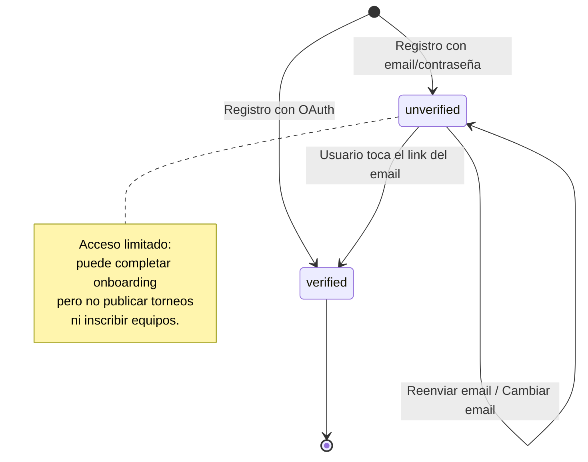
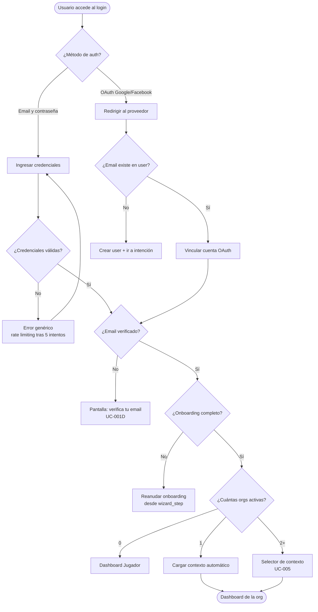
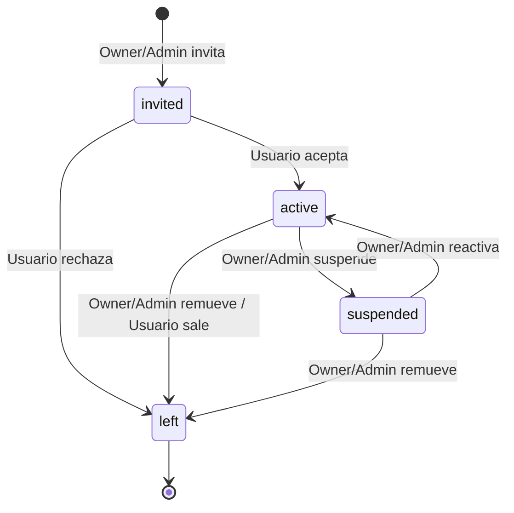
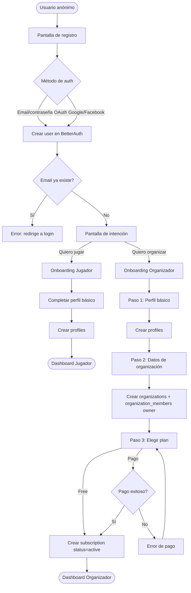
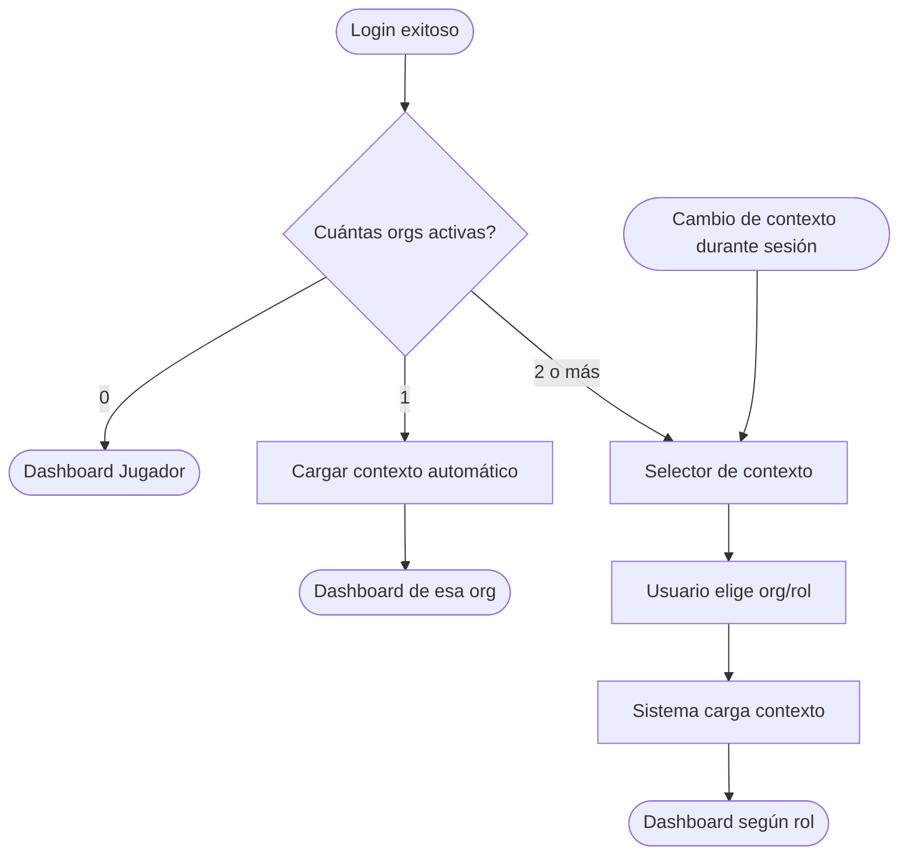
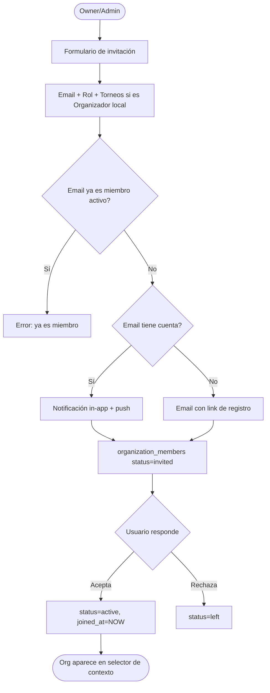

# Casos de Uso — Bloque 1: Identidad, Organizaciones y Roles

## Módulos cubiertos
- Registro y onboarding (jugador y organizador)
- Login (email/contraseña y OAuth)
- Recuperación de contraseña
- Verificación de email
- Creación y gestión de organizaciones
- Gestión de miembros y roles
- Multitenant y cambio de contexto

---

## Actores

| Actor | Descripción |
|---|---|
| Usuario anónimo | Persona sin cuenta. Puede ver torneos públicos. |
| Usuario registrado | Tiene cuenta. Puede ser jugador, capitán, miembro de org, etc. |
| Owner | Dueño de una organización. Control total + facturación. |
| Admin | Coordinador general de una organización. |
| Organizador local | Miembro con scope limitado a un torneo asignado. |
| Coach | Gestor de un equipo específico. Lo asigna el capitán. |
| Viewer | Acceso de solo lectura a una organización. |
| Sistema | Acciones automatizadas sin intervención humana. |

---

## UC-001 — Registro de usuario

**Actor principal:** Usuario anónimo
**Precondición:** El usuario no tiene cuenta en 4Sports.
**Trigger:** El usuario accede a la pantalla de registro.

### Flujo principal

1. El usuario accede a la pantalla de registro.
2. El sistema presenta dos opciones de autenticación: email/contraseña u OAuth (Google, Facebook).
3. El usuario elige su método y completa el paso de autenticación.
4. BetterAuth crea el registro `user` con email y nombre básico.
5. El sistema presenta la pantalla de intención: **"¿Para qué usarás 4Sports?"**
6. El usuario elige una de dos opciones:
   - **"Quiero jugar / unirme a un equipo"** → ir a UC-002 (Onboarding Jugador)
   - **"Quiero organizar mi liga o torneo"** → ir a UC-003 (Onboarding Organizador)

### Flujos alternativos

**FA-001A — Email ya registrado:**
En el paso 3, si el email ya existe, el sistema muestra error y redirige al login. No crea cuenta duplicada.

**FA-001B — OAuth con email ya existente:**
Si el email del OAuth ya está registrado por otro método, el sistema vincula la cuenta OAuth al `user` existente mediante la tabla `account` de BetterAuth.

**FA-001C — El usuario cierra la app antes de completar onboarding:**
El `user` existe en BetterAuth pero el `profile` está incompleto. Al volver a iniciar sesión, el sistema detecta el onboarding pendiente y lo reanuda desde donde quedó.

### Postcondición
- Registro `user` creado en BetterAuth.
- El usuario es dirigido al onboarding correspondiente a su intención.

### Notas técnicas
- BetterAuth maneja las tablas `user`, `session`, `account`, `verification`.
- El campo `profiles.is_looking_for_team` se inicializa según la intención elegida.
- La intención inicial no es permanente — el usuario puede crear una organización después desde su dashboard.

---

## UC-001B — Login (email/contraseña y OAuth)

**Actor principal:** Usuario registrado
**Precondición:** El usuario tiene cuenta activa en 4Sports.
**Trigger:** El usuario accede a la pantalla de login.

### Flujo principal — Email y contraseña

1. El usuario accede a la pantalla de login.
2. El sistema presenta el formulario: email y contraseña.
3. El usuario ingresa sus credenciales y confirma.
4. BetterAuth valida las credenciales contra la tabla `user`.
5. BetterAuth crea una sesión y emite la cookie de sesión.
6. El sistema consulta el perfil y el contexto del usuario:
   - Si `profiles.onboarding_completed_at IS NULL` → redirigir al onboarding pendiente (UC-002 o UC-003).
   - Si tiene 0 organizaciones activas → Dashboard de Jugador.
   - Si tiene 1 organización activa → cargar contexto automáticamente → Dashboard.
   - Si tiene 2+ organizaciones activas → Selector de contexto (UC-005).
7. El sistema registra `last_sign_in_at` en el `user` de BetterAuth.

### Flujo alternativo — OAuth (Google / Facebook)

1. El usuario toca "Continuar con Google" o "Continuar con Facebook".
2. El sistema redirige al proveedor OAuth.
3. El proveedor autentica al usuario y redirige de vuelta con el token.
4. BetterAuth procesa el token:
   - Si el email ya existe en `user`: vincula la cuenta OAuth a la cuenta existente via tabla `account`. Continúa con el paso 6 del flujo principal.
   - Si el email no existe: crea el `user` y redirige al flujo de intención (UC-001 paso 5).
5. Continúa desde el paso 6 del flujo principal.

### Flujos alternativos

**FA-001B-A — Credenciales incorrectas:**
BetterAuth retorna error de autenticación. El sistema muestra el mensaje genérico: "Email o contraseña incorrectos." No especifica cuál campo falló — por seguridad. Después de 5 intentos fallidos en 15 minutos, BetterAuth activa rate limiting automático.

**FA-001B-B — Cuenta con email no verificado:**
Si el usuario se registró con email/contraseña pero nunca verificó su email, el sistema lo detecta al login y muestra: "Debes verificar tu correo antes de continuar." Ofrece reenviar el email de verificación. El usuario no puede avanzar hasta verificar. Ver UC-001D.

**FA-001B-C — El proveedor OAuth falla o el usuario cancela:**
El sistema regresa a la pantalla de login con el mensaje: "No se pudo completar el acceso con [Google/Facebook]. Intenta de nuevo o usa tu email."

**FA-001B-D — Sesión activa en otro dispositivo:**
BetterAuth crea la nueva sesión normalmente. El usuario puede tener sesiones activas en múltiples dispositivos simultáneamente. No hay bloqueo.

**FA-001B-E — Onboarding incompleto detectado al login:**
El sistema detecta `profiles.onboarding_completed_at IS NULL`. Muestra el mensaje: "Casi listo — completa tu perfil para continuar." Redirige al paso del asistente donde se quedó (`wizard_step`).

### Postcondición
- Sesión activa creada en BetterAuth y almacenada en Redis.
- Cookie de sesión emitida al cliente.
- Usuario en el dashboard correspondiente a su contexto.

### Notas técnicas
- BetterAuth maneja el rate limiting de intentos fallidos — no implementar lógica propia.
- La cookie de sesión es `httpOnly` y `sameSite: strict` — el frontend nunca accede al token directamente.
- El contexto activo (organización seleccionada) se escribe en Redis al completar el login.
- `last_sign_in_at` lo actualiza BetterAuth automáticamente.

---

## UC-001C — Recuperación de contraseña

**Actor principal:** Usuario registrado (olvidó su contraseña)
**Precondición:** El usuario tiene cuenta con email/contraseña (no aplica a cuentas OAuth puras).
**Trigger:** El usuario toca "¿Olvidaste tu contraseña?" en la pantalla de login.

### Flujo principal

**Paso 1 — Solicitar el reset:**
1. El usuario toca "¿Olvidaste tu contraseña?" en la pantalla de login.
2. El sistema muestra un campo para ingresar el email.
3. El usuario ingresa su email y confirma.
4. El sistema responde siempre con el mismo mensaje, independientemente de si el email existe o no: **"Si ese correo está registrado, recibirás un enlace en los próximos minutos."** Esto previene la enumeración de cuentas.
5. Si el email existe en `user`: BetterAuth genera un token de reset y envía el email con el link de recuperación. El token tiene TTL de 1 hora.
6. Si el email no existe: no se envía nada. El mensaje al usuario es el mismo.

**Paso 2 — Usar el link de reset:**
7. El usuario recibe el email y toca el link.
8. El link incluye el token de reset: `4sports.com/reset-password?token=xxx`.
9. El sistema valida el token contra BetterAuth:
   - Si el token es válido y no ha expirado: mostrar el formulario de nueva contraseña.
   - Si el token expiró o ya fue usado: mostrar error y ofrecer solicitar uno nuevo.
10. El usuario ingresa su nueva contraseña (dos veces para confirmar).
11. BetterAuth actualiza la contraseña y invalida el token.
12. El sistema invalida todas las sesiones activas del usuario en todos los dispositivos.
13. El sistema muestra confirmación: "Contraseña actualizada. Inicia sesión con tu nueva contraseña."
14. El usuario es redirigido al login.

### Flujos alternativos

**FA-001C-A — El usuario solicita múltiples resets:**
Cada nueva solicitud invalida el token anterior. Solo el último link enviado es válido.

**FA-001C-B — El token expiró (más de 1 hora):**
El sistema muestra: "Este link ya expiró. Solicita uno nuevo." Redirige a la pantalla de recuperación.

**FA-001C-C — La cuenta es OAuth pura (sin contraseña):**
Si el email existe pero la cuenta fue creada exclusivamente con OAuth (Google/Facebook), el sistema muestra: "Esta cuenta usa [Google/Facebook] para iniciar sesión. No tienes contraseña configurada." Ofrece iniciar sesión con el proveedor OAuth.

**FA-001C-D — Nueva contraseña igual a la anterior:**
BetterAuth rechaza el cambio si la nueva contraseña es idéntica a la actual. El sistema muestra: "La nueva contraseña debe ser diferente a la anterior."

### Postcondición
- Contraseña actualizada en BetterAuth.
- Token de reset invalidado y no reutilizable.
- Todas las sesiones activas del usuario cerradas.
- El usuario debe iniciar sesión nuevamente.

### Notas técnicas
- Todo el flujo de reset lo maneja BetterAuth — no implementar lógica de tokens propia.
- El email de reset se envía via el proveedor de email configurado en BetterAuth (en MVP: Resend o similar).
- La invalidación de sesiones al cambiar contraseña es crítica — BetterAuth la hace automáticamente si está configurado correctamente.
- Nunca mostrar si un email está o no registrado en la respuesta del paso 4.

---

## UC-001D — Verificación de email

**Actor principal:** Usuario registrado (recién creado con email/contraseña)
**Precondición:** El usuario se registró con email/contraseña y el email aún no está verificado.
**Trigger:** El sistema envía el email de verificación automáticamente al crear la cuenta.

### Flujo principal

**Paso 1 — Envío automático:**
1. El usuario completa el registro con email/contraseña (UC-001).
2. BetterAuth genera un token de verificación y envía automáticamente el email de verificación.
3. El sistema muestra la pantalla de "Revisa tu correo":
   - "Enviamos un enlace a [email]. Toca el enlace para verificar tu cuenta."
   - Botón: "Reenviar email" (deshabilitado por 60 segundos para evitar spam).
   - Botón: "Cambiar email" (si el usuario se equivocó al escribirlo).
4. El usuario puede usar la app en modo limitado mientras no verifica — puede completar el onboarding pero no puede inscribir equipos ni publicar torneos.

**Paso 2 — El usuario verifica:**
5. El usuario abre su email y toca el link de verificación.
6. El link incluye el token: `4sports.com/verify-email?token=xxx`.
7. El sistema valida el token contra BetterAuth.
8. Si el token es válido: BetterAuth marca `emailVerified = true` en `user`.
9. El sistema muestra confirmación: "¡Email verificado! Tu cuenta está lista."
10. Si el usuario tiene sesión activa: el sistema actualiza el estado en Redis y redirige al dashboard.
11. Si el usuario no tiene sesión activa (verificó desde otro dispositivo): redirige al login.

### Flujos alternativos

**FA-001D-A — El usuario solicita reenviar el email:**
Después de 60 segundos, el botón "Reenviar email" se habilita. Al tocarlo, BetterAuth invalida el token anterior y genera uno nuevo. El sistema muestra: "Email reenviado. Revisa tu bandeja de entrada y tu carpeta de spam."

**FA-001D-B — El token de verificación expiró:**
Los tokens de verificación tienen TTL de 24 horas. Si el usuario toca el link después de ese tiempo, el sistema muestra: "Este link expiró. Solicita uno nuevo desde la app."

**FA-001D-C — El usuario quiere cambiar el email antes de verificar:**
El usuario puede modificar su email desde la pantalla de espera. El sistema invalida el token anterior y envía uno nuevo al email corregido. El email anterior queda liberado.

**FA-001D-D — El usuario intenta publicar un torneo o inscribir un equipo sin verificar:**
El sistema bloquea la acción con el mensaje: "Debes verificar tu email para realizar esta acción." Ofrece reenviar el email de verificación.

**FA-001D-E — Cuenta OAuth (Google / Facebook):**
Las cuentas creadas via OAuth no requieren verificación de email — el proveedor OAuth ya garantiza que el email es válido. `emailVerified = true` se establece automáticamente por BetterAuth al crear la cuenta OAuth.

### Postcondición
- `user.emailVerified = true` en BetterAuth.
- El usuario tiene acceso completo a todas las funciones de su plan.
- Token de verificación invalidado.

### Diagrama de estados de verificación



### Notas técnicas
- BetterAuth gestiona los tokens de verificación y el campo `emailVerified` automáticamente.
- El email de verificación se envía via el proveedor configurado en BetterAuth.
- La restricción de acceso para usuarios no verificados se implementa como un check en los guards relevantes: `if (!user.emailVerified) throw 403`.
- Las cuentas OAuth nunca pasan por este flujo.

---

## Diagrama de flujo — Login y acceso



---

## UC-002 — Onboarding Jugador

**Actor principal:** Usuario registrado (sin perfil completo)
**Precondición:** UC-001 completado. El usuario eligió "Quiero jugar".
**Trigger:** Sistema redirige al onboarding de jugador.

### Flujo principal

1. El sistema presenta el formulario de perfil de jugador.
2. El usuario completa los campos:
   - Nombre de usuario (username único)
   - Ciudad
   - Foto de perfil (opcional — sube a Cloudflare R2)
   - Deporte(s) de interés
   - Posición preferida (opcional)
   - ¿Estás buscando equipo? (toggle — inicializa `is_looking_for_team`)
3. El usuario confirma.
4. El sistema crea el registro `profiles` vinculado al `user`.
5. El sistema redirige al Dashboard de Jugador.

### Flujos alternativos

**FA-002A — Username ya tomado:**
El sistema valida en tiempo real. Si el username existe, sugiere variantes y bloquea el avance hasta elegir uno disponible.

**FA-002B — Campos opcionales vacíos:**
El perfil se crea con los campos mínimos. El usuario puede completar el resto desde su perfil en cualquier momento.

### Postcondición
- Registro `profiles` creado con `user_id` vinculado.
- El usuario accede a su Dashboard de Jugador.

---

## UC-003 — Onboarding Organizador

**Actor principal:** Usuario registrado (sin perfil completo)
**Precondición:** UC-001 completado. El usuario eligió "Quiero organizar".
**Trigger:** Sistema redirige al onboarding de organizador.

### Flujo principal

**Paso 1 — Perfil personal:**
1. El sistema presenta el formulario de perfil básico.
2. El usuario completa: nombre de usuario, ciudad, foto (opcional).
3. El sistema crea el registro `profiles`.

**Paso 2 — Datos de la organización:**
4. El sistema solicita los datos de la organización:
   - Nombre de la organización (genera `slug` automático, editable)
   - Deporte(s) que gestiona
   - Ciudad
   - Logo (opcional — sube a Cloudflare R2)
   - Descripción breve (opcional)
5. El usuario confirma.
6. El sistema crea el registro `organizations` con `created_by = user.id`.
7. El sistema crea el registro `organization_members` con `role = owner` y `status = active`.

**Paso 3 — Elección de plan:**
8. El sistema presenta los planes disponibles: Free, Starter, Pro, Elite.
9. Cada plan muestra sus límites y features clave.
10. El usuario elige un plan:
    - **Free:** continúa sin datos de pago → ir al paso 11.
    - **Starter / Pro / Elite:** el sistema solicita datos de pago → procesamiento via Stripe/MercadoPago → confirmación → ir al paso 11.
11. El sistema crea el registro `organizer_subscriptions` con el plan elegido y `status`:
    - Free: `active` permanente.
    - Pago: `trialing` si hay período de prueba, `active` si pagó directo.
12. El sistema redirige al Dashboard de Organizador con el primer torneo sugerido ("¿Quieres crear tu primer torneo?").

### Flujos alternativos

**FA-003A — Slug de organización ya existe:**
El sistema genera automáticamente una variante (ej. `liga-norte-2`). El usuario puede editarlo antes de confirmar.

**FA-003B — El usuario elige plan de pago pero el pago falla:**
El sistema muestra el error de la pasarela. El usuario puede reintentar o elegir el plan Free para continuar. La organización ya fue creada en el paso 6 — no se elimina.

**FA-003C — El usuario cierra la app entre Paso 2 y Paso 3:**
La organización y el owner ya existen. Al volver, el sistema detecta organización sin suscripción activa y lo lleva directamente al Paso 3.

### Postcondición
- `profiles` creado.
- `organizations` creado con `slug` único.
- `organization_members` con `role = owner`, `status = active`.
- `organizer_subscriptions` creado con el plan elegido.
- El organizador accede a su Dashboard.

### Notas técnicas
- Todo el Paso 1 + 2 + 3 debe completarse en una sola sesión guiada sin saltos de pantalla innecesarios.
- El `slug` de la organización se usa en URLs públicas: `4sports.com/org/{slug}`.
- Si el usuario llega a este flujo pero ya tiene una organización (ej. regresó a crear otra), el sistema lo detecta y le ofrece crear una organización adicional desde su dashboard existente.

---

## UC-004 — Crear organización adicional

**Actor principal:** Usuario registrado con perfil completo
**Precondición:** El usuario ya completó onboarding. Quiere gestionar una segunda liga o complejo.
**Trigger:** El usuario hace clic en "Nueva organización" desde su dashboard.

### Flujo principal

1. El usuario accede a "Crear nueva organización" desde su perfil o menú.
2. El sistema presenta el formulario de organización (mismo que Paso 2 de UC-003).
3. El usuario completa los datos y elige un plan.
4. El sistema crea `organizations` + `organization_members` (owner) + `organizer_subscriptions`.
5. El sistema agrega la nueva organización al selector de contexto del usuario.

### Postcondición
- Nueva organización creada con el usuario como owner.
- El selector de contexto muestra ahora múltiples organizaciones.

---

## UC-005 — Cambio de contexto (selector de organización/rol)

**Actor principal:** Usuario registrado con múltiples roles u organizaciones
**Precondición:** El usuario pertenece a más de una organización o tiene roles distintos.
**Trigger:** El usuario inicia sesión o hace clic en el selector de contexto.

### Flujo principal

1. Al iniciar sesión, el sistema consulta todos los `organization_members` activos del `user`.
2. Si el usuario pertenece a más de una organización:
   - El sistema presenta el selector de contexto: lista de organizaciones con nombre, logo y rol del usuario en cada una.
   - El usuario elige en qué organización/perfil desea operar.
3. Si el usuario pertenece a una sola organización:
   - El sistema lo lleva directamente al dashboard de esa organización.
4. Si el usuario no pertenece a ninguna organización:
   - El sistema lo lleva al Dashboard de Jugador.
5. El sistema carga el dashboard correspondiente al contexto elegido.

### Flujos alternativos

**FA-005A — Usuario cambia de contexto durante la sesión:**
Desde cualquier pantalla, el usuario puede acceder al selector de contexto en el header/menú. Al cambiar de organización, el sistema recarga el dashboard sin cerrar sesión.

**FA-005B — El rol del usuario en una organización fue suspendido mientras tenía sesión activa:**
El sistema detecta `status = suspended` en el siguiente request y redirige al selector de contexto. La organización suspendida aparece bloqueada con un mensaje explicativo.

### Postcondición
- El usuario opera dentro del contexto de la organización/rol elegido.
- Todos los requests subsecuentes se validan contra ese contexto en el backend.

### Notas técnicas
- El contexto activo se almacena en la sesión (Redis). No en localStorage.
- Cada request al backend valida: `organization_members.status = active` AND el recurso solicitado pertenece a la organización del contexto activo.
- Un `403 Forbidden` automático si el actor intenta acceder a recursos fuera de su scope.

---

## UC-006 — Invitar miembro a la organización

**Actor principal:** Owner o Admin
**Precondición:** La organización existe. El actor tiene rol `owner` o `admin`.
**Trigger:** El actor hace clic en "Invitar miembro" desde el panel de gestión de la organización.

### Flujo principal

1. El actor accede al panel de miembros de la organización.
2. El actor ingresa el email del usuario a invitar y selecciona su rol:
   - `admin`, `organizer`, `coach`, o `viewer`
3. Si el rol es `organizer`: el sistema solicita adicionalmente qué torneos tendrá asignados (`tournament_ids[]`).
4. El sistema valida que el email no esté ya registrado como miembro activo de la organización.
5. El sistema crea el registro `organization_members` con `status = invited`.
6. El sistema envía notificación/invitación al email del usuario:
   - Si el email tiene cuenta: notificación in-app + push.
   - Si el email no tiene cuenta: email con link para registrarse y unirse.
7. El sistema confirma al actor que la invitación fue enviada.

### Flujos alternativos

**FA-006A — El email ya es miembro activo:**
El sistema muestra error: "Este usuario ya es miembro de la organización con rol [X]." No crea duplicado.

**FA-006B — El email ya fue invitado pero no ha aceptado:**
El sistema ofrece: "Ya existe una invitación pendiente. ¿Deseas reenviarla?"

**FA-006C — El actor intenta invitar a alguien con rol igual o superior al suyo:**
Un `admin` no puede invitar a otro `owner`. El sistema bloquea la acción con mensaje de error.

### Postcondición
- `organization_members` creado con `status = invited`.
- El invitado recibe notificación según si tiene cuenta o no.

---

## UC-007 — Aceptar invitación a organización

**Actor principal:** Usuario registrado (invitado)
**Precondición:** Existe un `organization_members` con su `user_id` y `status = invited`.
**Trigger:** El usuario recibe la notificación y hace clic en "Aceptar invitación".

### Flujo principal

1. El usuario accede a la notificación o al link de invitación.
2. El sistema muestra los detalles: nombre de la organización, logo, rol asignado, y torneos asignados (si aplica).
3. El usuario confirma aceptación.
4. El sistema actualiza `organization_members`: `status = active`, `joined_at = NOW()`.
5. La organización aparece en el selector de contexto del usuario en su próximo login o inmediatamente si tiene sesión activa.

### Flujos alternativos

**FA-007A — El usuario no tiene cuenta aún:**
El link de invitación lo lleva al flujo de registro (UC-001). Al completar el registro, el sistema vincula automáticamente la invitación pendiente y la acepta.

**FA-007B — El usuario rechaza la invitación:**
El sistema actualiza `status = left`. El actor que invitó recibe una notificación de que fue rechazada.

**FA-007C — La invitación expiró (si se implementa TTL):**
El sistema muestra mensaje de invitación expirada y sugiere contactar al organizador.

### Postcondición
- `organization_members.status = active`.
- El usuario puede operar en la organización con su rol asignado.

---

## UC-008 — Modificar rol de un miembro

**Actor principal:** Owner o Admin
**Precondición:** El miembro tiene `status = active` en la organización.
**Trigger:** El actor edita el rol de un miembro desde el panel de gestión.

### Flujo principal

1. El actor accede al panel de miembros.
2. El actor selecciona un miembro y elige "Editar rol".
3. El sistema presenta los roles disponibles según la jerarquía del actor:
   - `owner` puede asignar cualquier rol incluyendo `admin`.
   - `admin` puede asignar `organizer`, `coach`, `viewer` — no puede promover a `admin` ni `owner`.
4. Si el nuevo rol es `organizer`: el sistema solicita los torneos asignados.
5. El actor confirma el cambio.
6. El sistema actualiza `organization_members.role` y `tournament_ids` si aplica.
7. El sistema notifica al miembro afectado del cambio de rol.
8. El sistema registra el cambio en `audit_logs`.

### Flujos alternativos

**FA-008A — El actor intenta degradar al único Owner:**
El sistema bloquea la acción. Siempre debe existir al menos un `owner` activo en la organización.

**FA-008B — El actor intenta promover a alguien a un rol igual o superior al suyo:**
Un `admin` no puede promover a otro `admin`. El sistema bloquea con mensaje de error.

### Postcondición
- `organization_members.role` actualizado.
- `audit_logs` registra quién hizo el cambio, cuándo y de qué rol a cuál.
- El miembro afectado recibe notificación.

---

## UC-009 — Suspender o remover miembro

**Actor principal:** Owner o Admin
**Precondición:** El miembro tiene `status = active` en la organización.
**Trigger:** El actor elige "Suspender" o "Remover" desde el panel de miembros.

### Flujo principal — Suspender

1. El actor elige "Suspender" en el miembro objetivo.
2. El sistema solicita confirmación y motivo (opcional).
3. El sistema actualiza `organization_members.status = suspended`.
4. Si el miembro tiene sesión activa, el sistema invalida su acceso en el próximo request (403).
5. El sistema registra en `audit_logs`.

### Flujo principal — Remover

1. El actor elige "Remover" en el miembro objetivo.
2. El sistema solicita confirmación con advertencia: "El miembro perderá acceso inmediato a la organización."
3. El sistema actualiza `organization_members.status = left`, `left_at = NOW()`.
4. El acceso se invalida inmediatamente.
5. El sistema registra en `audit_logs`.

### Flujos alternativos

**FA-009A — El actor intenta suspender/remover al único Owner:**
El sistema bloquea la acción. Mensaje: "No puedes remover al único dueño de la organización."

**FA-009B — El Admin intenta remover a otro Admin:**
El sistema bloquea. Solo el Owner puede modificar roles de Admin.

### Postcondición
- El miembro pierde acceso inmediato.
- `audit_logs` registra la acción con actor, timestamp y motivo.

---

## UC-010 — Transferir ownership de la organización

**Actor principal:** Owner
**Precondición:** El nuevo owner es miembro activo de la organización.
**Trigger:** El Owner elige "Transferir propiedad" desde la configuración de la organización.

### Flujo principal

1. El Owner accede a Configuración → Transferir propiedad.
2. El sistema muestra los miembros activos disponibles para recibir la propiedad.
3. El Owner selecciona al nuevo owner y confirma con su contraseña (verificación de seguridad).
4. El sistema actualiza:
   - El miembro seleccionado: `role = owner`.
   - El Owner anterior: `role = admin` (sigue en la organización).
5. El sistema notifica al nuevo owner.
6. El sistema registra en `audit_logs`.

### Postcondición
- El nuevo owner tiene acceso completo incluyendo facturación.
- El owner anterior continúa como admin.

---

## Diagrama de estados — organization_members.status



---

## Diagrama de flujo — Registro y onboarding



---

## Diagrama de flujo — Cambio de contexto multitenant



---

## Diagrama de flujo — Invitación de miembro



---

## Revisión del schema — Gaps y observaciones

### Tablas involucradas
`user` (BetterAuth) · `profiles` · `organizations` · `organization_members` · `organizer_subscriptions` · `subscription_plans` · `permissions` · `role_permissions`

### ✅ Lo que el schema v3 ya soporta correctamente
- Relación `profiles.user_id → user.id` (TEXT, compatible con BetterAuth).
- `organization_members` con `role`, `status`, `tournament_ids[]` y `invited_by`.
- `organizer_subscriptions` con `status`, `trial_ends_at` y `current_period_end`.
- Soft delete en `organizations` con `deleted_at`.
- `audit_logs` con `actor_user_id`, `action`, `entity_type`, `before_data`, `after_data`.

### ⚠️ Gaps detectados

**GAP-001 — Onboarding incompleto sin estado explícito:**
Si el usuario cierra la app entre el Paso 1 y Paso 3 del onboarding, no hay un campo en `profiles` u `organizations` que indique en qué paso quedó. Se recomienda agregar:
```sql
-- En profiles:
onboarding_completed_at TIMESTAMPTZ  -- null = onboarding pendiente

-- En organizations:
onboarding_step INT DEFAULT 1  -- 1=perfil, 2=org, 3=plan
```

**GAP-002 — Invitaciones sin TTL (expiración):**
`organization_members` no tiene `expires_at` para invitaciones. Las invitaciones pendientes pueden quedar abiertas indefinidamente. Se recomienda agregar:
```sql
-- En organization_members:
invitation_expires_at TIMESTAMPTZ  -- null = sin expiración
```

**GAP-003 — Sin registro de onboarding de intención inicial:**
No hay campo que registre si el usuario se registró como "jugador" u "organizador". Útil para analytics y para reanudar el onboarding. Se recomienda:
```sql
-- En profiles:
initial_intent TEXT  -- 'player' | 'organizer'
```

**GAP-004 — Transferencia de ownership sin verificación de seguridad:**
El schema no tiene mecanismo para registrar que el Owner verificó su identidad antes de transferir la propiedad. Es un control de proceso, no de schema, pero debe implementarse en la capa de servicio obligatoriamente.

### 📝 Decisiones de diseño confirmadas
- Los planes se cobran por organización, no por usuario.
- `organization_members.tournament_ids[]` es el mecanismo de scope para organizadores locales.
- El contexto activo del usuario (qué organización está operando) vive en Redis, no en la BD.
- BetterAuth vincula OAuth al `user` existente si el email coincide — no crea cuenta duplicada.
