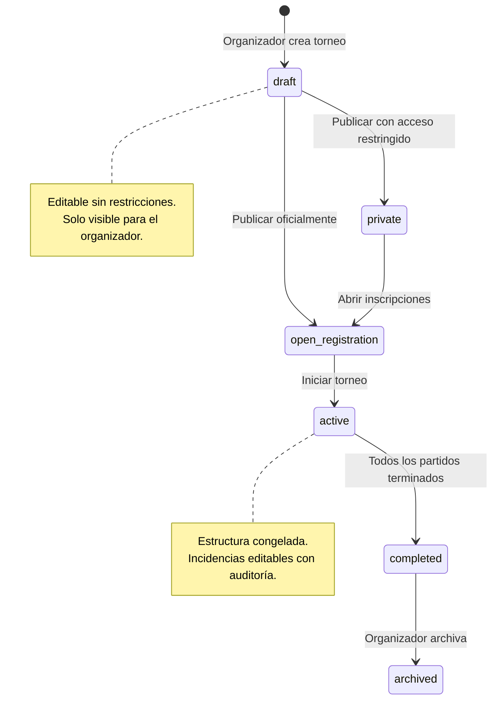
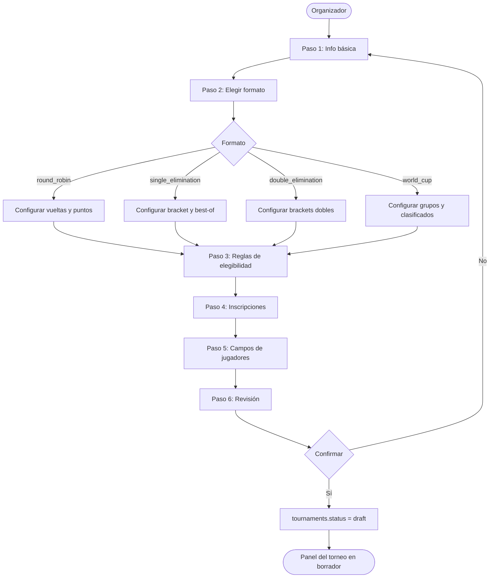
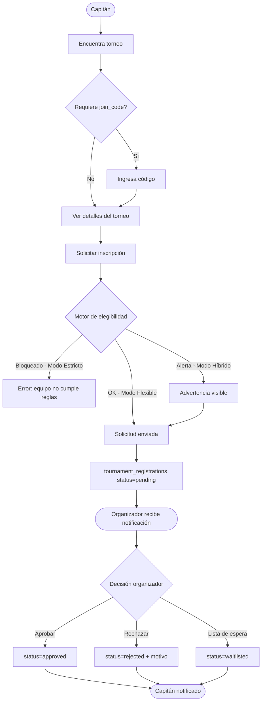
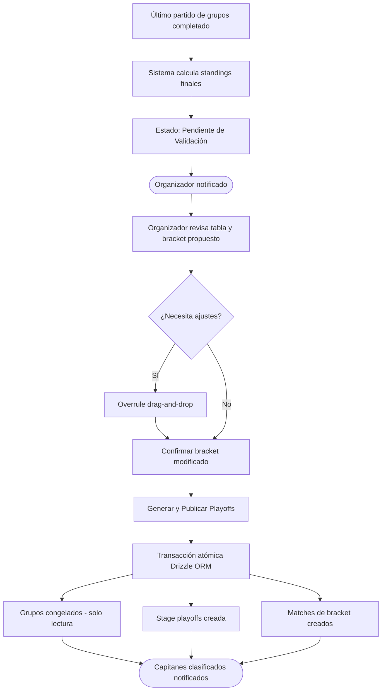
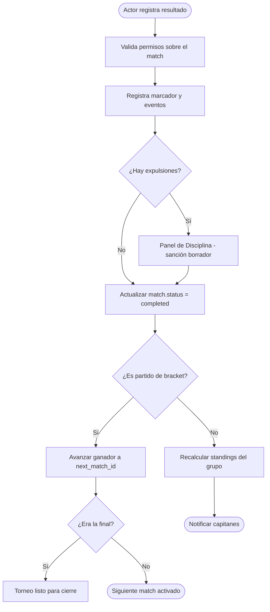

# Casos de Uso — Bloque 2: Torneos

## Módulos cubiertos
- Creación y configuración de torneos
- Equipos internos y externos
- Formatos de competición (Round Robin, Eliminación directa, Modo Mundial)
- Tablas de posiciones y tiebreakers
- Ciclo de vida del torneo post-publicación

---

## Actores

| Actor | Descripción |
|---|---|
| Organizador | Owner o Admin de la organización. Crea y gestiona torneos. |
| Organizador local | Miembro con scope limitado a un torneo asignado. |
| Capitán | Gestor de un equipo. Inscribe equipos y jugadores. |
| Sistema | Acciones automatizadas (cálculo de standings, generación de fixtures, webhooks). |
| Usuario anónimo | Puede ver torneos públicos sin cuenta. |

---

## Catálogo de formatos soportados en MVP

| Código | Nombre | Descripción |
|---|---|---|
| `round_robin` | Round Robin / Liga Todos contra Todos | Cada equipo juega contra todos los demás. Clasificación por tabla de puntos o PCT. |
| `single_elimination` | Eliminación Directa / Knockout / Playoffs | El que pierde queda fuera. Bracket de llave simple. |
| `double_elimination` | Doble Eliminación | El equipo necesita perder dos veces para quedar eliminado. Bracket ganadores + perdedores. |
| `world_cup` | Modo Mundial / Formato Mixto | Fase de Grupos (Round Robin interno) + Eliminación Directa para clasificados. |

---

## UC-101 — Crear torneo (Asistente guiado)

**Actor principal:** Organizador
**Precondición:** La organización existe y tiene suscripción activa compatible con el formato elegido.
**Trigger:** El organizador hace clic en "Crear torneo" desde su dashboard.

### Flujo principal

**Paso 1 — Información básica:**
1. El sistema presenta el formulario de información básica del torneo.
2. El organizador completa:
   - Nombre del torneo
   - Deporte (selector — carga `sports` de la BD)
   - Tags opcionales de contexto (texto plano, ej. "Femenil", "Sub-17", "Veteranos")
   - Descripción breve (opcional)
   - Banner / imagen de portada (opcional — Cloudflare R2)
   - Reglamento en PDF (opcional — Cloudflare R2)
3. El sistema genera el `slug` automáticamente desde el nombre. El organizador puede editarlo.

**Paso 2 — Formato de competición:**
4. El sistema presenta los formatos disponibles según el plan del organizador:
   - Free/Starter: `round_robin`, `single_elimination`
   - Pro+: todos los formatos incluyendo `double_elimination` y `world_cup`
5. El organizador elige el formato.
6. Según el formato elegido, el asistente hace preguntas específicas:

   **Si `round_robin`:**
   - ¿Cuántos equipos participan?
   - ¿Cuántas vueltas? (1 = cada par juega una vez, 2 = ida y vuelta)
   - Sistema de puntos: el sistema inyecta el default del deporte (editable).
   - Criterios de desempate: el sistema inyecta el default del deporte (reordenables).

   **Si `single_elimination`:**
   - ¿Cuántos equipos participan? (el sistema valida que sea potencia de 2 o advierte sobre byes)
   - ¿Hay partido por tercer lugar?
   - ¿Mejor de cuántos partidos por cruce? (Best of 1 / 3 / 5)

   **Si `double_elimination`:**
   - ¿Cuántos equipos participan?
   - ¿Mejor de cuántos partidos por cruce?
   - ¿Cómo se juega la gran final? (1 partido / el equipo de bracket ganadores necesita perder una vez para ser eliminado)

   **Si `world_cup`:**
   - ¿Cuántos equipos participan?
   - ¿Cuántos equipos por grupo? (el sistema sugiere el número óptimo)
   - ¿Cuántos clasifican por grupo?
   - El sistema genera la vista previa: "X grupos de Y equipos, Z clasificados por grupo dan N equipos al bracket."
   - Sistema de puntos para fase de grupos: default del deporte (editable).
   - Criterios de desempate: default del deporte (reordenables).
   - ¿Hay partido por tercer lugar?

**Paso 3 — Reglas de elegibilidad:**
7. El organizador configura las restricciones del torneo:
   - Restricción de género: Ninguna / Solo masculino / Solo femenino / Mixto
   - Edad mínima (opcional)
   - Edad máxima (opcional)
   - Modo de validación de plantilla: Estricto / Flexible / Híbrido (default)
   - Motor de elegibilidad: Flexible / Estricto (un jugador en un solo equipo por torneo)
8. El sistema muestra el resumen de reglas configuradas.

**Paso 4 — Inscripciones:**
9. El organizador configura el proceso de inscripción:
   - ¿Requiere aprobación manual? (toggle)
   - Número máximo de equipos (opcional)
   - Número mínimo de equipos para iniciar
   - Número mínimo de jugadores por equipo
   - Número máximo de jugadores por equipo
   - ¿Permite equipos externos? (toggle)
   - ¿Requiere código de acceso? (genera `join_code` automático, editable)
   - Fechas: apertura de inscripciones, cierre de inscripciones, inicio del torneo, fin estimado

**Paso 5 — Campos de jugadores:**
10. El organizador configura qué datos se solicitan al registrar jugadores (basado en `player_fields` JSONB):
    - Cada campo tiene dos toggles: Visible / Requerido
    - Campos disponibles: sexo, fecha de nacimiento, email, teléfono, número de jersey

**Paso 6 — Revisión y modo borrador:**
11. El sistema presenta el resumen completo del torneo configurado.
12. El organizador puede regresar a cualquier paso a modificar.
13. El organizador confirma → el torneo se crea con `status = draft`.
14. El sistema estampa `created_under_plan` con el plan activo de la organización.
15. El sistema redirige al panel del torneo en Modo Borrador.

### Flujos alternativos

**FA-101A — Formato no disponible en el plan actual:**
El sistema muestra el formato con un candado y el plan requerido. El organizador puede continuar con un formato compatible o ir a la pantalla de upgrade.

**FA-101B — Número de equipos incompatible con el formato:**
En `single_elimination` con un número que no es potencia de 2, el sistema advierte y ofrece dos opciones: agregar equipos con bye (descanso automático) o reducir al número válido más cercano.

**FA-101C — El organizador abandona el asistente a mitad:**
El sistema guarda el borrador incompleto. El organizador puede retomarlo desde el dashboard con el estado `draft` y un indicador de progreso.

**FA-101D — Slug ya existe en la organización:**
El sistema agrega un sufijo numérico automático (`liga-verano-2`). El organizador puede editarlo.

### Postcondición
- `tournaments` creado con `status = draft`.
- `created_under_plan` estampado e inmutable desde este momento.
- `tournament_metrics` creados con los defaults del deporte elegido.
- El organizador accede al panel del torneo en Modo Borrador.

### Notas técnicas
- El default de `settings.tiebreaker[]` se inyecta desde la configuración del deporte en BD, no hardcodeado en el servicio.
- Los tiebreakers son editables hasta que se registra el primer resultado del torneo. Después: solo lectura.
- `tournament.settings` almacena en JSONB: `points_win`, `points_draw`, `points_loss`, `tiebreaker[]`, `has_third_place_match`, `sets_to_win`, `rounds_per_match`.

---

## UC-102 — Publicar torneo (Modo Borrador → Oficial)

**Actor principal:** Organizador
**Precondición:** El torneo existe con `status = draft`. Tiene al menos la configuración mínima completa.
**Trigger:** El organizador hace clic en "Publicar oficialmente".

### Flujo principal

1. El sistema ejecuta validaciones pre-publicación:
   - Formato configurado y válido.
   - Al menos un deporte asignado.
   - Fechas de inscripción y inicio definidas.
   - Si el plan es Free: valida que no supere el límite de torneos simultáneos activos (2).
2. Si todas las validaciones pasan, el sistema muestra el resumen final y solicita confirmación.
3. El organizador confirma.
4. El sistema ejecuta la transición en una transacción atómica:
   - `tournaments.status` → `open_registration` (si la fecha de apertura ya pasó) o `private` (si aún no).
   - `tournaments.locked_at` → `NULL` (aún editable en incidencias).
   - Genera `join_code` si no existe y el torneo lo requiere.
5. El sistema notifica a todos los miembros de la organización con rol ≥ `organizer`.
6. Si el torneo es público, queda visible en el directorio de torneos.

### Flujos alternativos

**FA-102A — Validación falla (límite de plan):**
El sistema muestra qué validación falló y ofrece el upgrade de plan o la opción de archivar un torneo activo anterior.

**FA-102B — El organizador quiere volver al borrador después de publicar:**
No es posible revertir a `draft`. El organizador puede editar incidencias (horarios, canchas, configuración de inscripciones) pero no la estructura del torneo.

### Postcondición
- `tournaments.status` actualizado.
- `tournaments.created_under_plan` confirmado e inmutable.
- El torneo es visible según su configuración de privacidad.

---

## UC-103 — Crear equipo interno

**Actor principal:** Organizador u Organizador local
**Precondición:** El torneo existe con `status` ≥ `open_registration`. El actor tiene permisos sobre el torneo.
**Trigger:** El organizador hace clic en "Agregar equipo" → "Crear equipo nuevo" desde el panel del torneo.

### Flujo principal

1. El actor accede al panel de equipos del torneo.
2. El actor elige "Crear equipo interno".
3. El sistema presenta el formulario:
   - Nombre del equipo (requerido)
   - Nombre corto / alias (opcional)
   - Logo (opcional — R2)
   - Color principal y secundario (opcional)
   - Ciudad (opcional)
   - Tipo de género del equipo: Masculino / Femenino / Mixto
4. El actor confirma.
5. El sistema crea el registro `teams` con `scope = tournament_scoped` y `organization_id` de la organización.
6. El sistema crea el registro `tournament_registrations` con `status = approved` e `is_external = false`.
7. El sistema confirma la creación. El equipo aparece en el panel de equipos del torneo.

### Flujos alternativos

**FA-103A — Nombre de equipo ya existe en el torneo:**
El sistema advierte pero no bloquea — permite equipos homónimos en torneos distintos. En el mismo torneo muestra una advertencia para evitar confusión.

**FA-103B — El organizador supera el límite de equipos del torneo:**
Si `max_teams` está configurado, el sistema bloquea la creación y muestra el límite alcanzado.

### Postcondición
- `teams` creado con `scope = tournament_scoped`.
- `tournament_registrations` creado con `status = approved`.
- El equipo está listo para recibir jugadores.

---

## UC-104 — Inscribir equipo externo (con aprobación manual)

**Actor principal:** Capitán (equipo externo) + Organizador (aprueba)
**Precondición:** El torneo tiene `status = open_registration` y `requires_approval = true`.
**Trigger:** El capitán encuentra el torneo y solicita inscribir su equipo.

### Flujo — Parte A: Solicitud del capitán

1. El capitán accede al torneo (por búsqueda, link público o `join_code`).
2. El sistema muestra los detalles del torneo: deporte, formato, fechas, reglas de elegibilidad.
3. El capitán hace clic en "Inscribir mi equipo".
4. El sistema verifica que el capitán tiene un equipo activo compatible:
   - Si tiene equipo existente: lo selecciona o crea uno nuevo.
   - Si no tiene equipo: el sistema lo dirige al flujo de creación de equipo (UC-201).
5. El sistema valida las reglas de elegibilidad del torneo contra los datos del equipo disponibles.
6. Si hay jugadores con perfil real que no cumplen (género, edad): el sistema bloquea o advierte según el modo de validación configurado.
7. El capitán envía la solicitud de inscripción.
8. El sistema crea `tournament_registrations` con `status = pending`.
9. El sistema notifica al organizador: "El equipo [X] solicita inscribirse en [torneo]."

### Flujo — Parte B: Revisión del organizador

10. El organizador accede al panel de inscripciones pendientes.
11. El sistema muestra la ficha del equipo: nombre, jugadores registrados, alertas de elegibilidad.
12. El organizador revisa y elige:
    - **Aprobar:** `status = approved`. El sistema notifica al capitán. El equipo entra al torneo.
    - **Rechazar:** El organizador escribe el motivo. `status = rejected`. El sistema notifica al capitán con el motivo.
    - **Lista de espera:** `status = waitlisted`. El sistema notifica al capitán.

### Flujos alternativos

**FA-104A — Torneo sin aprobación manual (`requires_approval = false`):**
En el paso 8, el sistema aprueba automáticamente la inscripción sin intervención del organizador. `status = approved` directo.

**FA-104B — Torneo con `join_code`:**
En el paso 1, si el torneo requiere código, el capitán debe ingresar el `join_code` antes de ver los detalles. Sin código válido, el torneo no aparece ni en búsquedas.

**FA-104C — El torneo alcanzó `max_teams`:**
El sistema bloquea nuevas solicitudes. Si hay lista de espera habilitada, la solicitud entra como `waitlisted`.

**FA-104D — El capitán no tiene cuenta (acceso por token):**
El organizador puede compartir un link de capitán (UC-205) que permite gestionar el equipo sin cuenta completa.

### Postcondición
- `tournament_registrations.status` = `approved` / `rejected` / `waitlisted`.
- Ambas partes notificadas.
- Si aprobado: el equipo es visible en el panel del torneo.

---

## UC-105 — Generar fixtures (calendario de partidos)

**Actor principal:** Organizador
**Precondición:** El torneo tiene suficientes equipos inscritos y aprobados para el formato configurado.
**Trigger:** El organizador hace clic en "Generar calendario" desde el panel del torneo.

### Flujo principal — Round Robin

1. El sistema valida que hay al menos 2 equipos aprobados.
2. El organizador elige el modo de generación:
   - **Automático completo:** el sistema asigna fechas y canchas según disponibilidad configurada.
   - **Solo cruces:** el sistema genera quién juega contra quién, el organizador asigna fechas a mano.
3. El sistema ejecuta el algoritmo round-robin (algoritmo de rotación circular):
   - Con N equipos, genera N-1 jornadas (o 2N-2 con ida y vuelta).
   - Cada equipo juega exactamente una vez por jornada.
   - Si N es impar, un equipo tiene `bye` (descanso) por jornada.
4. Si modo automático: el sistema aplica el calculador de bloques de tiempo y distribuye los partidos en los slots de cancha disponibles. Respeta:
   - Disponibilidad de canchas por día/hora.
   - Descanso mínimo configurado entre partidos del mismo equipo.
   - Toggle de múltiples partidos por equipo por día.
5. El sistema presenta la vista previa del calendario completo.
6. El organizador puede hacer ajustes manuales (arrastrar partidos, cambiar horarios, reasignar canchas).
7. El organizador confirma → el sistema crea los registros `matches` con `status = scheduled`.

### Flujo principal — Single Elimination

1. El sistema valida que los equipos son suficientes para el bracket.
2. Si el número de equipos no es potencia de 2, el sistema genera `byes` automáticos para los equipos mejor clasificados (por seed o por orden de inscripción).
3. El sistema genera el árbol del bracket: cruces por ronda, `next_match_id` encadenando el ganador hacia la siguiente ronda.
4. Si hay partido por tercer lugar: se crea el match adicional con `is_third_place_match = true`.
5. El sistema presenta la vista previa del bracket.
6. El organizador puede modificar el seeding (arrastrar equipos en el bracket).
7. El organizador confirma → el sistema crea los registros `stages`, `rounds`, `matches`.

### Flujo principal — Double Elimination

1. El sistema genera dos brackets paralelos: `bracket_type = 'winners'` y `bracket_type = 'losers'`.
2. Cada vez que un equipo pierde en el bracket de ganadores, pasa al bracket de perdedores.
3. El perdedor del bracket de ganadores y el ganador del bracket de perdedores se enfrentan en la gran final (`bracket_type = 'grand_final'`).
4. Si el equipo del bracket de perdedores gana la gran final: se juega un partido definitivo (el equipo del bracket de ganadores aún no ha perdido dos veces).
5. El sistema gestiona automáticamente el `loser_next_match_id` para enrutar a los equipos eliminados al bracket correcto.

### Flujo principal — Modo Mundial (Fase de Grupos)

1. El sistema distribuye los equipos en grupos según la configuración del asistente.
2. Si el seeding está habilitado: distribuye respetando los seeds (equipos top en distintos grupos).
3. El organizador puede mover equipos entre grupos manualmente antes de confirmar.
4. El sistema genera los partidos de fase de grupos como round-robin interno por grupo.
5. El organizador confirma → el sistema crea `stages` (fase_grupos), `groups`, `group_teams`, `rounds`, `matches`.
6. La fase de playoffs se genera después (UC-106) — no en este paso.

### Postcondición
- `stages`, `groups` (si aplica), `brackets` (si aplica), `rounds`, `matches` creados.
- Todos los `matches` con `status = scheduled`.
- El calendario es visible para capitanes y fanáticos según la privacidad del torneo.

---

## UC-106 — Transición Fase de Grupos → Playoffs (Modo Mundial)

**Actor principal:** Organizador + Sistema
**Precondición:** Todos los partidos de la fase de grupos tienen `status = completed`.
**Trigger:** Se registra el resultado del último partido de grupos.

### Flujo principal

**Paso 1 — Cierre automático de fase (Sistema):**
1. El sistema detecta que todos los matches de la `stage` de grupos están `completed`.
2. El sistema ejecuta el algoritmo de standings por grupo:
   - Calcula puntos, diferencia de goles/puntos, goles a favor según `settings.tiebreaker[]`.
   - Ordena los equipos dentro de cada grupo.
   - Identifica los clasificados según la configuración (ej. top 2 por grupo).
3. El torneo entra en estado intermedio en el panel del organizador: **"Fase de Grupos Concluida — Pendiente de Validación"**.
4. El sistema notifica al organizador.

**Paso 2 — Revisión del organizador (UX):**
5. El organizador accede al panel de transición.
6. El sistema muestra:
   - Tabla de posiciones final de cada grupo.
   - Vista previa del bracket propuesto (ej. 1°A vs 2°B, 1°B vs 2°A).
7. El organizador puede:
   - **Validar:** los cruces están correctos → ir al paso 8.
   - **Modificar (Overrule):** arrastrar equipos para cambiar cruces antes de confirmar (ej. descalificación administrativa).

**Paso 3 — Generación oficial (Organizador dispara):**
8. El organizador hace clic en "Generar y Publicar Playoffs".
9. El sistema ejecuta una transacción atómica en Drizzle ORM:
   - Las tablas de grupos pasan a solo lectura (matches de grupos: no editables en resultados).
   - Se crea la nueva `stage` de playoffs con `stage_type = 'bracket'`.
   - Se crean los `matches` del bracket con los equipos clasificados en los cruces confirmados.
   - `tournament.status` se mantiene en `active`.
10. El sistema dispara notificaciones a los capitanes de equipos clasificados: "¡Clasificaste a los Playoffs! Revisa tu próximo rival."
11. El bracket es visible públicamente en la app.

### Flujos alternativos

**FA-106A — Hay partidos de grupos aún pendientes:**
El sistema no permite la transición. Muestra qué partidos faltan y quién es responsable de reportar el resultado.

**FA-106B — Empate técnico que el tiebreaker no puede resolver:**
Si dos equipos quedan matemáticamente igualados en todos los criterios configurados, el sistema marca el conflicto como "Requiere decisión manual". El organizador decide cuál clasifica (ej. sorteo) y registra la justificación en el Panel de Disciplina.

### Postcondición
- `stages` de playoffs creada con sus `matches`.
- Grupos congelados (solo lectura en resultados).
- Capitanes clasificados notificados.

---

## UC-107 — Registrar resultado de partido

**Actor principal:** Organizador, Organizador local, o Capitán (según configuración)
**Precondición:** El match tiene `status = scheduled` o `in_progress`. El actor tiene permisos sobre el partido.
**Trigger:** El actor abre la cédula del partido para registrar el resultado.

### Flujo principal — Nivel Básico (Modo Express)

1. El actor abre la cédula del partido.
2. El sistema muestra: equipos, cancha, horario programado.
3. El actor ingresa el marcador final: goles/puntos local y visitante.
4. El actor puede registrar incidencias críticas: expulsiones con `forces_game_ejection = true`.
5. El actor confirma el resultado.
6. El sistema actualiza:
   - `matches.home_score`, `matches.away_score`, `matches.winner_team_id`.
   - `matches.status = completed`.
   - `standings` del torneo/grupo (recalculado en consulta, no almacenado fijo).
7. Si hay expulsiones: los eventos saltan al Panel de Disciplina automáticamente.
8. Si el partido es de bracket: el sistema avanza al ganador al siguiente match (`next_match_id`) automáticamente.
9. El sistema notifica a los capitanes de ambos equipos con el resultado.

### Flujo principal — Nivel Estándar

Igual al anterior, más:
3b. Por cada gol/punto anotado, el actor registra: jugador, minuto del evento, tipo (gol, autogol, asistencia, tarjeta).
El sistema crea registros en `player_stat_values` y `match_results` por período.

### Flujo principal — Nivel Avanzado

Igual al Estándar, más:
3c. El actor puede registrar métricas adicionales según el deporte: tiros a puerta, rebotes, asistencias, etc.
Cada métrica crea un `player_stat_values` o `team_stat_values` con el `metric_id` correspondiente.

### Flujos alternativos

**FA-107A — Corrección de resultado post-registro:**
Solo un Organizador o Admin puede modificar un resultado ya registrado. El sistema:
- Registra en `audit_logs`: actor, timestamp, resultado anterior, resultado nuevo, motivo.
- Publica en el tablón de anuncios del torneo: "El resultado del partido X fue corregido."
- Recalcula standings si aplica.

**FA-107B — Resultado en bracket genera empate en formato Best-of:**
El sistema lleva el conteo de partidos ganados por serie. El ganador de la serie se determina al alcanzar el número requerido de victorias. No existe empate en eliminación directa.

**FA-107C — Partido cancelado:**
`matches.status = cancelled`. El sistema no lo cuenta en standings. El organizador puede reprogramarlo.

**FA-107D — Partido forfeit (equipo no se presenta):**
`matches.status = forfeit`. El sistema aplica el resultado de walkover configurado en `settings.walkover_score`. El equipo que no se presentó recibe la derrota y el punto de "Walkover" se refleja en standings.

### Postcondición
- `matches.status = completed`.
- `standings` actualizado (se recalcula en cada consulta).
- `player_stat_values` / `team_stat_values` creados si el nivel lo requiere.
- Si bracket: ganador avanzado al siguiente match.
- Expulsiones enviadas al Panel de Disciplina.

---

## UC-108 — Tablas de posiciones (Standings)

**Actor principal:** Sistema (cálculo automático)
**Precondición:** Hay al menos un partido `completed` en el torneo/grupo.
**Trigger:** Cualquier consulta a la tabla de posiciones desde la app.

### Lógica de cálculo — Tabla por Puntos (Fútbol, Hockey, Rugby)

El sistema no almacena el ranking fijo. Cada consulta ejecuta:

1. Extrae todos los `matches.status = completed` del torneo/stage/group.
2. Agrupa por equipo y calcula: PJ, PG, PE, PP, GF, GC, DG, Pts.
3. Aplica el array `settings.tiebreaker[]` como función de ordenamiento jerárquico:

```
Fútbol (default):
1. Puntos (DESC)
2. Diferencia de goles (DESC)
3. Goles a favor (DESC)
4. Resultado head-to-head
5. Fair Play (menos tarjetas, ASC)
```

4. Retorna la tabla ordenada con `rank` calculado al vuelo.

### Lógica de cálculo — Tabla por Porcentaje de Victoria (Básquetbol, Béisbol)

1. Extrae partidos completados del equipo.
2. Calcula PCT = Victorias / Partidos Jugados.
3. Aplica tiebreaker:

```
Básquetbol (default):
1. PCT (DESC)
2. Puntos en duelos directos
3. Diferencia de puntos anotados

Béisbol (default):
1. PCT (DESC)
2. Resultado head-to-head
3. Diferencia de carreras
```

### Reglas de tiebreakers

| Regla | Aplicación |
|---|---|
| Los defaults se inyectan desde el deporte al crear el torneo | `sports.metadata` contiene el array default |
| El organizador puede reordenar/agregar/eliminar antes del primer partido | `tournaments.settings.tiebreaker[]` editable |
| Al registrar el primer resultado: tiebreakers bloqueados | El servicio verifica si `matches.count(completed) > 0` antes de permitir edición |
| Si dos equipos siguen igualados tras todos los criterios | El sistema marca "Requiere decisión manual" — el organizador resuelve |

---

## UC-109 — Dar de baja a un equipo durante el torneo

**Actor principal:** Organizador
**Precondición:** El torneo tiene `status = active`. El equipo tiene `status = approved` en `tournament_registrations`.
**Trigger:** El organizador elige "Dar de baja" en un equipo desde el panel.

### Flujo principal

1. El organizador accede al panel de equipos del torneo.
2. El organizador selecciona el equipo y elige "Dar de baja".
3. El sistema solicita confirmación con advertencia: "Esta acción resolverá automáticamente los partidos pendientes de este equipo como walkover."
4. El organizador confirma.
5. El sistema ejecuta en transacción atómica:
   - `tournament_registrations.status = withdrawn` para el equipo.
   - Todos los `matches` pendientes del equipo (scheduled) con ese equipo:
     - `status = forfeit`
     - El rival recibe el resultado de walkover configurado en `settings.walkover_score`
     - `winner_team_id` = el equipo rival
   - Los partidos ya completados del equipo se mantienen intactos.
   - Se recalculan los standings.
   - Si el torneo usa bracket: el rival avanza al siguiente match automáticamente.
6. El sistema publica en el tablón: "[Equipo X] ha sido dado de baja del torneo. Sus partidos pendientes han sido resueltos como walkover."
7. El sistema notifica a todos los capitanes afectados.
8. El sistema registra en `audit_logs`.

### Postcondición
- El equipo queda fuera del torneo.
- Los partidos pendientes resueltos como walkover.
- Standings actualizados.
- Todos los afectados notificados con transparencia.

---

## UC-110 — Cerrar torneo y pasar a histórico

**Actor principal:** Organizador
**Precondición:** Todos los `matches` del torneo tienen `status = completed` o `cancelled`/`forfeit`.
**Trigger:** El organizador hace clic en "Cerrar torneo" o el sistema detecta que no quedan partidos pendientes.

### Flujo principal

1. El sistema detecta (o el organizador activa manualmente) que no quedan partidos pendientes.
2. El sistema calcula el ranking final del torneo:
   - Campeón, subcampeón, tercer lugar (si aplica).
   - Tabla de goleadores/líderes estadísticos.
3. El organizador revisa el resumen final y confirma el cierre.
4. El sistema:
   - `tournaments.status = completed`.
   - Genera un snapshot en `tournament_archives` con el estado completo del torneo.
   - El histórico queda accesible públicamente según el plan del organizador.
5. El sistema publica en el tablón: "¡El torneo [X] ha finalizado! Campeón: [Equipo Y]."
6. El sistema notifica a todos los participantes.

### Postcondición
- `tournaments.status = completed`.
- `tournament_archives` creado con snapshot completo.
- Historial público visible (condicionado al plan).

---

## Diagramas

### Ciclo de vida del torneo



### Flujo de creación de torneo (asistente)



### Flujo de inscripción con aprobación manual



### Transición Fase de Grupos → Playoffs



### Flujo de resultado de partido en bracket



---

## Revisión del schema — Gaps y observaciones

### Tablas involucradas
`tournaments` · `tournament_categories` · `tournament_metrics` · `tournament_registrations` · `stages` · `groups` · `group_teams` · `brackets` · `rounds` · `matches` · `match_results` · `standings` · `player_stat_values` · `team_stat_values`

### ✅ Lo que el schema v3 ya soporta correctamente

- `tournaments.settings` JSONB soporta `tiebreaker[]`, `points_win/draw/loss`, `walkover_score`, `has_third_place_match`.
- `tournaments.created_under_plan` para el ciclo de vida protegido.
- `matches.next_match_id` y `matches.loser_next_match_id` para encadenar el bracket (single y double elimination).
- `matches.is_third_place_match` para el partido por bronce.
- `matches.status` con todos los estados necesarios: `scheduled`, `in_progress`, `completed`, `cancelled`, `forfeit`, `disputed`.
- `brackets.bracket_type` soporta `winners`, `losers`, `grand_final` para double elimination.
- `standings` con `extra_stats JSONB` para métricas adicionales sin migración.
- `player_stat_values.minute` para eventos con timestamp dentro del partido.
- `tournament_registrations.status` con todos los estados: `pending`, `approved`, `rejected`, `waitlisted`, `withdrawn`.

### ⚠️ Gaps detectados

**GAP-101 — Sin campo para el paso de onboarding del torneo:**
Si el organizador abandona el asistente a mitad, no hay estado explícito de progreso. Recomendado:
```sql
-- En tournaments:
wizard_step INT DEFAULT 1  -- 1=info, 2=formato, 3=elegibilidad, 4=inscripciones, 5=campos, 6=revisión
wizard_completed_at TIMESTAMPTZ  -- null = borrador incompleto
```

**GAP-102 — Sin campo para el estado de transición Grupos → Playoffs:**
El estado intermedio "Fase de Grupos Concluida — Pendiente de Validación" no existe en el schema. Recomendado:
```sql
-- En stages:
transition_status TEXT DEFAULT 'not_started'
-- valores: 'not_started' | 'groups_pending_validation' | 'playoffs_generated'
transition_validated_at TIMESTAMPTZ
transition_validated_by TEXT  -- user.id del organizador que aprobó
```

**GAP-103 — Tags de contexto no están en el schema:**
El campo de tags opcionales (ej. "Femenil", "Sub-17") no existe en `tournaments`. Recomendado:
```sql
-- En tournaments:
tags TEXT[] DEFAULT '{}'  -- array de texto plano para filtros dinámicos
```

**GAP-104 — Sin campo `walkover_score` en settings:**
El marcador de walkover está mencionado en el PRD pero no hay un campo explícito en el JSONB de settings. Debe documentarse como parte del schema de `settings`:
```json
{
  "walkover_score": { "winner": 3, "loser": 0 },
  "points_win": 3,
  "points_draw": 1,
  "points_loss": 0,
  "tiebreaker": ["points", "goal_difference", "goals_for", "head_to_head"],
  "has_third_place_match": true
}
```

**GAP-105 — Sin índice para consultas de standings frecuentes:**
Los standings se calculan en cada consulta. Para torneos con muchos partidos, conviene agregar:
```sql
CREATE INDEX idx_matches_completed_tournament
  ON matches(tournament_id, status)
  WHERE status = 'completed';

CREATE INDEX idx_matches_completed_stage
  ON matches(stage_id, status)
  WHERE status = 'completed';
```

**GAP-106 — `tournament_registrations` sin campo para seed del equipo en grupos:**
El seeding para la distribución en grupos no tiene campo explícito. El schema tiene `seed INT` en `tournament_registrations`, que es correcto. Solo documentar que este campo se usa para el Modo Mundial al distribuir equipos en grupos.

### 📝 Decisiones de diseño confirmadas

- Los standings no se almacenan con ranking fijo — se calculan en cada consulta aplicando `settings.tiebreaker[]`.
- Los tiebreakers se bloquean tras el primer partido completado del torneo.
- La transición Grupos → Playoffs es siempre manual (organizador dispara) — nunca automática.
- Los defaults de tiebreakers y sistema de puntos se inyectan desde `sports.metadata` al crear el torneo.
- Las categorías no son entidades obligatorias — las restricciones viven en las reglas de elegibilidad del torneo.
- Los tags son texto plano nullable — no entidades relacionales.
- `scope = tournament_scoped` para equipos internos creados por el organizador.
- El bypass de suscripción usa `created_under_plan` — un torneo Pro sigue corriendo aunque la suscripción venza.
