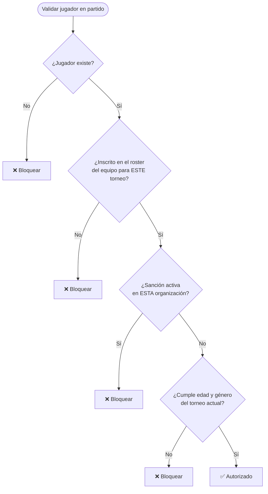
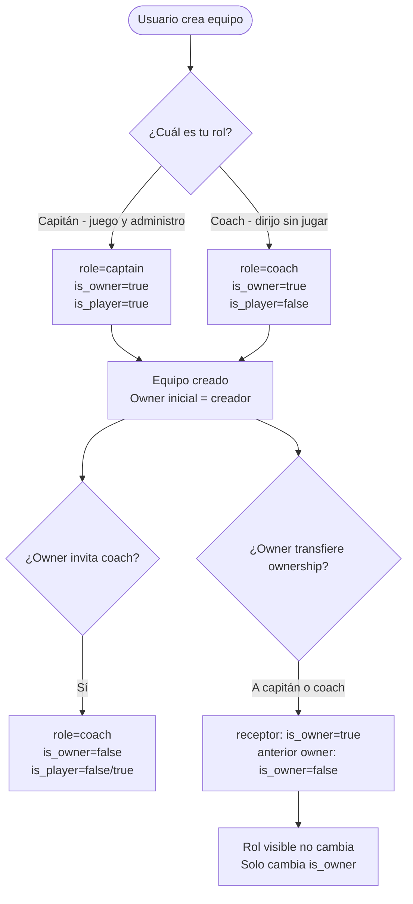
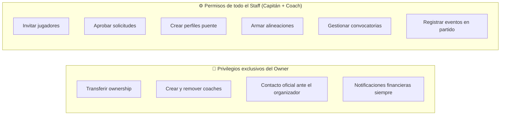
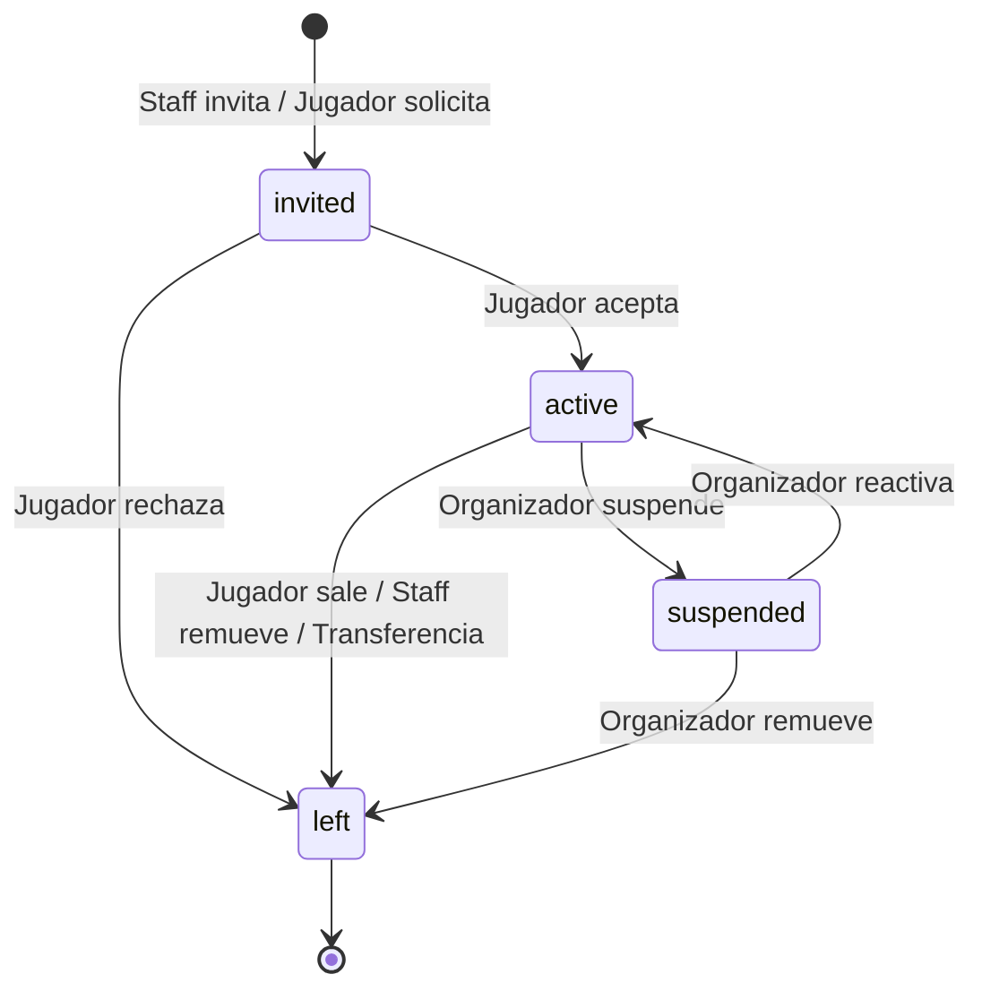
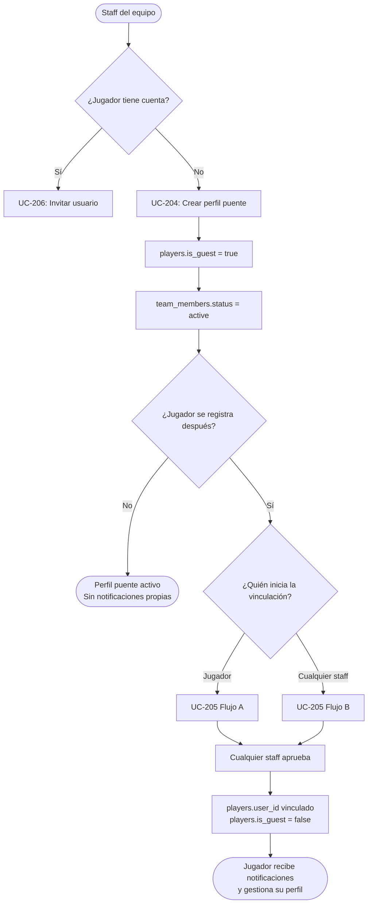
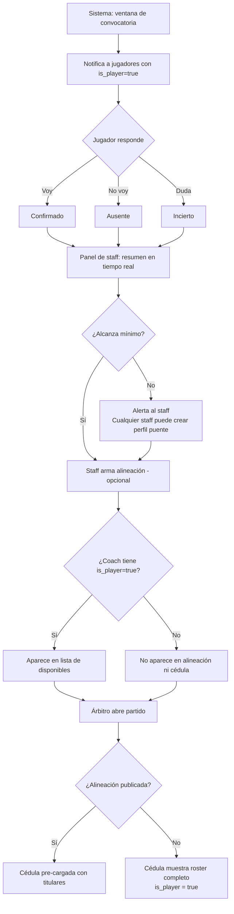
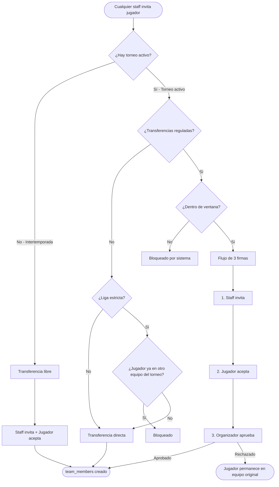

# Casos de Uso — Bloque 3: Equipos y Jugadores (v2)

## Módulos cubiertos
- Creación de equipos con elección de rol inicial
- Modelo de ownership independiente del rol visible
- Perfiles puente (guest players)
- Vinculación de identidad
- Invitación y gestión de jugadores
- Roles: Captain, Coach, Player, Substitute
- Convocatorias y alineaciones
- Transferencias entre temporadas
- Motor de elegibilidad multitenant

---

## Actores

| Actor | Descripción |
|---|---|
| Owner del equipo | Tiene `is_owner = true`. Privilegios exclusivos: transferir ownership, crear/remover coaches, contacto oficial ante el organizador. Solo 1 por equipo. |
| Capitán | `role = captain`. Staff del equipo con permisos completos de gestión. Puede ser owner o no. Aparece en el roster si `is_player = true`. |
| Coach | `role = coach`. Staff del equipo con permisos completos de gestión. Puede ser owner si se le transfirió. No aparece en el roster a menos que `is_player = true`. |
| Jugador | `role = player`. Miembro del roster. Sin permisos de gestión. |
| Suplente | `role = substitute`. Miembro del roster. Sin permisos de gestión. |
| Organizador | Aprueba transferencias reguladas y gestiona el motor de elegibilidad del torneo. |
| Sistema | Valida elegibilidad, dispara convocatorias, bloquea inscripciones fuera de ventana. |

---

## Modelo de roles — referencia rápida

### Dos dimensiones independientes en `team_members`

| Campo | Valores | Qué controla |
|---|---|---|
| `role` | `captain` / `coach` / `player` / `substitute` | Cómo aparece el miembro en el equipo públicamente |
| `is_owner` | `true` / `false` | Quién tiene los privilegios exclusivos del equipo. Solo 1 por equipo. |
| `is_player` | `true` / `false` | Si aparece en el roster jugable del partido |

### Permisos por tipo de miembro

| Acción | Owner | Capitán (no owner) | Coach (no owner) | Player / Sub |
|---|---|---|---|---|
| Invitar jugadores y coaches | ✅ | ✅ | ✅ | ❌ |
| Aprobar solicitudes de ingreso | ✅ | ✅ | ✅ | ❌ |
| Crear perfiles puente | ✅ | ✅ | ✅ | ❌ |
| Armar alineaciones | ✅ | ✅ | ✅ | ❌ |
| Gestionar convocatorias | ✅ | ✅ | ✅ | ❌ |
| Registrar eventos en partido | ✅ | ✅ | ✅ | ❌ |
| Ver estado de cuenta financiero | ✅ | ✅ | Configurable | ❌ |
| Recibir notificaciones financieras | ✅ Siempre | ✅ Siempre | Configurable | ❌ |
| Transferir ownership | ✅ | ❌ | ❌ | ❌ |
| Crear / remover coaches | ✅ | ❌ | ❌ | ❌ |
| Es contacto oficial ante el organizador | ✅ | ❌ | ❌ | ❌ |
| Remover miembros del equipo | ✅ | ✅ staff únicamente | ✅ staff únicamente | ❌ |

### Escenario Juan y Pedro

```
Juan crea el equipo:
  Juan  → role: captain, is_owner: true,  is_player: true

Juan invita a Pedro como coach:
  Pedro → role: coach,   is_owner: false, is_player: false

Juan transfiere ownership a Pedro:
  Juan  → role: captain, is_owner: false, is_player: true
  Pedro → role: coach,   is_owner: true,  is_player: false

Resultado: Pedro es el contacto oficial y puede crear coaches.
Juan sigue gestionando el equipo con permisos completos de staff.
```

---

## Arquitectura multitenant de identidad

### Regla de oro
Un usuario tiene una identidad única y global. Sus sanciones, límites de equipo y elegibilidad están encapsulados por organización. Las organizaciones son entornos lógicamente aislados.

### Árbol de validación de elegibilidad



Las suspensiones tienen alcance local por organización. Una tarjeta roja en la Organización A no bloquea al jugador en la Organización B.

---

## UC-201 — Crear equipo

**Actor principal:** Usuario registrado
**Precondición:** El usuario tiene cuenta activa con onboarding completado.
**Trigger:** El usuario hace clic en "Crear equipo" desde su dashboard o desde el flujo de inscripción a un torneo.

### Flujo principal

1. El usuario accede a "Crear equipo".
2. El sistema presenta el formulario básico del equipo:
   - Nombre del equipo (requerido)
   - Nombre corto / alias (opcional)
   - Logo (opcional — Cloudflare R2)
   - Color principal y secundario (opcional)
   - Ciudad (opcional)
   - Tipo de género: Masculino / Femenino / Mixto
   - Política de ingreso: `open` / `request` / `invite_only` / `code`
3. El sistema pregunta el rol inicial del creador:
   - **"Soy el Capitán"** — juego en el equipo y lo administro.
   - **"Soy el Entrenador (Coach)"** — dirijo el equipo pero no juego.
4. El usuario elige su rol y confirma.
5. El sistema crea el registro `teams`.
6. El sistema crea `team_members` para el creador:
   - Si eligió Capitán: `role = captain`, `is_owner = true`, `is_player = true`, `status = active`.
   - Si eligió Coach: `role = coach`, `is_owner = true`, `is_player = false`, `status = active`.
7. En ambos casos: `is_owner = true` — el creador siempre es el owner inicial.
8. El sistema redirige al panel del equipo.

### Flujos alternativos

**FA-201A — El usuario crea el equipo desde el flujo de inscripción a un torneo:**
Después del paso 4, el sistema continúa directamente al UC-104 (inscripción de equipo externo) con el equipo recién creado preseleccionado.

**FA-201B — El organizador crea el equipo desde el panel del torneo (equipo interno):**
El organizador no elige rol de jugador. El equipo se crea como `tournament_scoped` y se registra directamente con `tournament_registrations.status = approved`. El organizador no es miembro del equipo.

**FA-201C — El Coach quiere también jugar en el equipo:**
Después de crear el equipo como Coach, puede actualizar `is_player = true` desde la configuración del equipo. El sistema lo agrega al roster jugable.

### Postcondición
- `teams` creado.
- `team_members` con el creador como owner (`is_owner = true`).
- El rol visible depende de la elección del creador.

---

## UC-202 — Invitar Coach al equipo

**Actor principal:** Owner del equipo
**Precondición:** El actor tiene `is_owner = true` en el equipo.
**Trigger:** El owner accede al panel del equipo → "Agregar Coach".

### Flujo principal

1. El owner accede a la gestión del equipo → "Staff" → "Agregar entrenador".
2. El owner busca al usuario por username o email.
3. El sistema valida que el usuario no es ya miembro activo del equipo.
4. El owner configura el rol del coach:
   - ¿Aparece en el roster como jugador? (`is_player`: Sí / No)
   - ¿Recibe notificaciones financieras? (toggle)
5. El owner confirma la invitación.
6. El sistema crea `team_invitations` con `role = coach`.
7. El sistema notifica al usuario invitado.
8. El usuario acepta → `team_members` creado con `role = coach`, `is_owner = false`.

### Flujos alternativos

**FA-202A — El usuario no tiene cuenta:**
El owner puede ingresar solo el email. El sistema envía una invitación por email con link de registro. Al registrarse, el usuario queda vinculado al equipo automáticamente como coach.

**FA-202B — El owner intenta agregar un segundo coach:**
No hay límite de coaches por equipo. El sistema permite múltiples coaches simultáneos.

**FA-202C — El coach invitado ya era jugador del equipo:**
El sistema detecta la membresía existente y actualiza `role = coach` en lugar de crear un registro duplicado. El usuario pasa de jugador a coach con permisos completos de staff.

### Postcondición
- Coach activo en el equipo con permisos completos de gestión.
- `is_owner = false` — los privilegios exclusivos siguen con el owner.

---

## UC-203 — Transferir ownership del equipo

**Actor principal:** Owner del equipo
**Precondición:** El actor tiene `is_owner = true`. El receptor es miembro activo del equipo (capitán o coach).
**Trigger:** El owner accede a Configuración del equipo → "Transferir liderazgo".

### Flujo principal

1. El owner accede a Configuración → "Transferir liderazgo del equipo".
2. El sistema muestra los miembros elegibles para recibir el ownership:
   - Solo capitanes y coaches con `status = active`.
   - No jugadores ni suplentes.
3. El owner selecciona al receptor y confirma con su contraseña.
4. El sistema ejecuta la transferencia en transacción atómica:
   - Receptor: `is_owner = true`.
   - Owner anterior: `is_owner = false`.
   - El rol visible (`role`) de ambos no cambia.
5. El sistema notifica al receptor: "Ahora eres el líder del equipo [X]."
6. El sistema registra en `audit_logs`.

### Flujos alternativos

**FA-203A — El receptor es un jugador (no staff):**
El sistema bloquea. Solo capitanes y coaches pueden recibir el ownership. Mensaje: "Solo puedes transferir el liderazgo a un capitán o entrenador del equipo."

**FA-203B — El owner quiere salir del equipo después de transferir:**
Puede hacerlo desde UC-211 (salir del equipo). El equipo queda con el nuevo owner como única autoridad.

### Postcondición
- Nuevo owner con privilegios exclusivos.
- Owner anterior conserva su rol y permisos de staff si sigue en el equipo.
- `audit_logs` registra la transferencia.

---

## UC-204 — Crear perfil puente (Guest Player)

**Actor principal:** Capitán o Coach (cualquier miembro staff)
**Precondición:** El actor es miembro staff del equipo (`role = captain` o `role = coach`).
**Trigger:** El actor agrega un jugador que no tiene cuenta en la plataforma.

### Flujo principal

1. El actor accede al panel de plantilla → "Agregar jugador" → "Registrar manualmente".
2. El sistema presenta el formulario mínimo:
   - Nombre completo (requerido)
   - Rol en el equipo: Jugador / Suplente (requerido)
   - Número de jersey (opcional)
   - Posición (opcional)
   - Campos adicionales según `tournament.player_fields` del torneo activo:
     - Fecha de nacimiento (si el torneo valida edad)
     - Sexo (si el torneo tiene restricción de género)
3. El actor confirma.
4. El sistema crea `players` con `is_guest = true`, `guest_created_by = user.id` del actor.
5. El sistema crea `team_members` con `status = active` — no requiere aceptación al ser perfil puente.

### Flujos alternativos

**FA-204A — Modo Estricto y datos incompletos:**
El sistema crea el perfil puente pero lo marca con alerta de elegibilidad. Participa en el equipo pero el motor de elegibilidad lo bloqueará en el partido hasta que los datos sean completados o el perfil sea vinculado a un usuario real.

**FA-204B — Carga masiva (migración desde Excel):**
El actor puede usar el formulario de carga múltiple: nombre, jersey y posición de varios jugadores en una sola pantalla. El sistema crea todos los perfiles puente en lote.

### Postcondición
- `players` creado con `is_guest = true`.
- `team_members` activo.
- Sin notificaciones — el perfil puente no tiene canal de comunicación propio.

---

## UC-205 — Reclamar perfil puente (Vinculación de identidad)

**Actor principal:** Jugador (usuario registrado) + Cualquier miembro staff (aprueba)
**Precondición:** Existe `players.is_guest = true` en un equipo. El jugador tiene cuenta activa.
**Trigger:** El jugador busca su perfil puente desde la app, O cualquier miembro staff envía invitación de vinculación.

### Regla de oro
La plataforma **jamás** infiere ni fusiona identidades automáticamente por nombre. Siempre requiere confirmación humana en dos pasos. La aprobación la puede dar cualquier miembro staff del equipo — no solo el capitán.

### Flujo A — Iniciado por el jugador

1. El jugador accede a su perfil → "¿Jugaste antes en 4Sports? Reclama tu historial".
2. El sistema muestra un buscador de perfiles puente por nombre y equipo.
3. El jugador localiza su perfil y envía la solicitud.
4. El sistema notifica a **todos los miembros staff** del equipo (capitanes y coaches): "[Usuario X] solicita reclamar el perfil [Nombre]. ¿Confirmas que es la misma persona?"
5. Cualquier miembro staff puede aprobar o rechazar:
   - **Aprobar:** ejecutar la vinculación → paso 6.
   - **Rechazar:** solicitud descartada.
6. El sistema ejecuta la vinculación:
   - `players.user_id = user.id`.
   - `players.is_guest = false`.
   - Historial intacto — estadísticas no se recalculan.
7. El jugador puede recibir notificaciones y gestionar su perfil.

### Flujo B — Iniciado por staff

1. Cualquier miembro staff accede a la plantilla y selecciona un perfil puente.
2. El actor elige "Enviar invitación de vinculación".
3. El actor ingresa el email o teléfono del jugador real.
4. Si el email/teléfono tiene cuenta: notificación in-app.
5. Si no tiene cuenta: email con link de registro que pre-vincula el perfil al completar el onboarding.
6. El jugador acepta → vinculación ejecutada igual que el paso 6 del Flujo A.

### Caso especial — Múltiples perfiles históricos

Si el jugador tuvo perfiles puente en varios equipos distintos, puede reclamar cada uno en orden. Su `user_id` se vincula a todos esos registros. Las estadísticas de cada temporada permanecen bajo el equipo donde se generaron.

### Postcondición
- `players.user_id` vinculado. `players.is_guest = false`.
- Historial intacto. Sin recalculos de estadísticas pasadas.

---

## UC-206 — Invitar jugador con cuenta existente

**Actor principal:** Cualquier miembro staff (capitán o coach)
**Precondición:** El actor es miembro staff del equipo.
**Trigger:** El actor quiere agregar a un usuario registrado en 4Sports.

### Flujo principal

1. El actor accede a la plantilla → "Agregar jugador" → "Invitar usuario".
2. El actor busca al jugador por username, email o perfil público.
3. El sistema valida la elegibilidad previa:
   - ¿Ya está en otro equipo del mismo torneo (liga estricta)?
   - ¿Tiene sanciones activas en esta organización?
   - ¿Cumple restricciones de edad/género del torneo?
4. Según `validation_mode`:
   - Estricto: bloquea si no cumple.
   - Híbrido: alerta visible pero permite continuar.
   - Flexible: permite siempre.
5. El actor asigna: rol (`player` / `substitute`), número de jersey, posición.
6. El sistema crea `team_invitations` y notifica al jugador.
7. El jugador acepta → `team_members` creado con `status = active`.
8. El jugador rechaza → `team_invitations.declined_at` registrado. Staff notificado.

### Flujos alternativos

**FA-206A — El jugador solicita unirse por su cuenta:**
Si `join_policy = open`: `team_members` creado directamente.
Si `join_policy = request`: cualquier miembro staff puede aprobar o rechazar desde el panel.

### Postcondición
- `team_invitations` enviada. Si aceptada: `team_members` activo.

---

## UC-207 — Generar link de capitán (Captain Invite Token)

**Actor principal:** Organizador del torneo
**Precondición:** El torneo existe. Se necesita dar acceso de gestión a alguien sin cuenta completa.
**Trigger:** El organizador genera un link desde el panel del torneo.

### Flujo principal

1. El organizador genera el token desde el panel del equipo → "Generar link de acceso".
2. El sistema genera `captain_invite_tokens.token` con `expires_at` configurable.
3. El organizador comparte el link: `4sports.com/captain/{token}`.
4. El receptor accede:
   - Con cuenta: autenticado y asignado como staff (capitán o coach según configuración) del equipo.
   - Sin cuenta: registro simplificado → acceso de staff al completar.
5. El receptor puede gestionar la plantilla del equipo sin acceso a otras áreas.
6. `captain_invite_tokens.is_used = true`, `used_at = NOW()`.

### Postcondición
- Token usado. El receptor tiene acceso temporal de staff al equipo.

---

## UC-208 — Convocatoria de partido (Fase 1)

**Actor principal:** Sistema (dispara) + Jugadores/Coaches (responden) + Staff (monitorea)
**Precondición:** El partido tiene `status = scheduled`.
**Trigger:** El sistema detecta que el partido entra en la ventana de convocatoria (ej. 48h antes).

### Flujo principal

1. El sistema abre la convocatoria y notifica a todos los `team_members` con `is_player = true` y `status = active`.
2. Los coaches con `is_player = false` **no** reciben la convocatoria de asistencia — no van a jugar.
3. Cada jugador responde: ✅ Voy / ❌ No voy / ❓ Duda.
4. El panel de cualquier miembro staff muestra el resumen en tiempo real:
   - Confirmados / Ausentes / Dudas / Sin responder.
   - Alerta si los confirmados no alcanzan el mínimo requerido.
5. Si el conteo está por debajo del mínimo, cualquier staff puede crear perfiles puente de emergencia.

### Flujos alternativos

**FA-208A — Un coach tiene `is_player = true`:**
Recibe la convocatoria como jugador y debe confirmar su asistencia igual que los demás.

**FA-208B — Perfil puente sin cuenta:**
No recibe notificación. El staff gestiona su confirmación manualmente o usa el botón "Compartir en WhatsApp".

### Postcondición
- Staff tiene visibilidad del conteo antes del partido.
- Confirmados disponibles para la Fase 2 (alineación).

---

## UC-209 — Alineación táctica (Fase 2)

**Actor principal:** Cualquier miembro staff (capitán o coach)
**Precondición:** La convocatoria está abierta. Hay al menos un jugador confirmado.
**Trigger:** El actor accede a la pizarra táctica del partido.

### Flujo principal

1. El actor accede a la ficha del partido → "Armar alineación".
2. El sistema muestra jugadores disponibles:
   - Con respuesta "Voy" en la convocatoria.
   - Perfiles puente del equipo (siempre disponibles).
   - Con respuesta "Duda" (marcados visualmente).
   - **No incluye coaches con `is_player = false`** en la lista de titulares/suplentes.
3. El actor arrastra jugadores a dos zonas: Titulares / Suplentes.
4. El actor asigna posición táctica a cada titular (opcional).
5. El actor elige visibilidad: Borrador privado / Publicar.
6. Si se publica: fanáticos y rivales ven la alineación en la ficha del partido.

### Interacción con la cédula arbitral

- Si la alineación fue publicada: el árbitro ve pre-cargados a los titulares.
- Si no hay alineación: el árbitro ve el roster completo de jugadores (`is_player = true`).
- Los coaches sin `is_player` no aparecen en la cédula arbitral.

### Flujos alternativos

**FA-209A — El coach también juega (`is_player = true`):**
Aparece en la lista de disponibles como cualquier otro jugador. El staff puede ponerlo de titular o suplente.

**FA-209B — Nadie armó la alineación:**
El partido no se bloquea. La Fase 2 es completamente opcional.

### Postcondición
- Alineación guardada. Si publicada: visible para la comunidad.
- Cédula arbitral pre-cargada con los titulares.

---

## UC-210 — Transferencia en intertemporada

**Actor principal:** Cualquier staff del nuevo equipo + Jugador
**Precondición:** No hay torneo activo que involucre al jugador en esa organización.
**Trigger:** Cualquier miembro staff del nuevo equipo invita al jugador.

### Flujo principal

1. Cualquier staff del nuevo equipo invita al jugador (UC-206).
2. El jugador acepta.
3. El sistema crea `team_members` en el nuevo equipo.
4. El sistema mantiene el historial del equipo anterior intacto:
   - `team_members` anterior: `left_at = NOW()`, `status = left`.
   - `player_stat_values` anteriores: sin modificación.
5. El perfil del jugador muestra el historial por temporada y equipo.

### Regla de negocio
En intertemporada no se requiere aprobación del staff anterior ni restricciones de fecha.

### Postcondición
- Jugador activo en el nuevo equipo. Historial anterior intacto.

---

## UC-211 — Transferencia durante torneo activo (Ventana de fichajes)

**Actor principal:** Cualquier staff del nuevo equipo + Jugador + Organizador (aprueba)
**Precondición:** Torneo `status = active`. El organizador activó "Transferencias Reguladas".
**Trigger:** Staff intenta agregar un jugador que ya disputó minutos en otro equipo del mismo torneo.

### Flujo — Tres firmas

1. El sistema verifica que la transferencia está dentro de la ventana configurada (por fecha o jornada). Fuera de ventana: bloqueo automático.
2. **Firma 1 — Staff:** cualquier miembro staff del nuevo equipo envía la invitación.
3. **Firma 2 — Jugador:** el jugador acepta el traspaso.
4. **Firma 3 — Organizador:** el organizador revisa y aprueba o rechaza desde su panel, revisando adeudos y sanciones pendientes con el equipo anterior.

### Flujo alternativo — Sin regulación

Si el organizador no activó "Transferencias Reguladas": solo se requieren las firmas del staff y el jugador. Sin aprobación del organizador.

### Postcondición
- Si aprobada: jugador en nuevo equipo, estadísticas anteriores congeladas.
- Si rechazada: jugador permanece en el equipo original.
- `audit_logs` registra toda la operación.

---

## UC-212 — Salir del equipo

**Actor principal:** Cualquier miembro del equipo
**Precondición:** El miembro tiene `status = active` en el equipo.
**Trigger:** El miembro decide salir desde la configuración del equipo.

### Flujo principal

1. El miembro accede a la configuración del equipo → "Salir del equipo".
2. El sistema advierte sobre las consecuencias:
   - Si es el **owner**: "Debes transferir el liderazgo antes de salir."
   - Si es **staff sin torneo activo**: salida inmediata permitida.
   - Si es **jugador con torneo activo**: advertencia de que sus estadísticas en curso se conservan pero ya no podrá jugar.
3. Si es el único owner: el sistema bloquea la salida hasta que transfiera el ownership.
4. El miembro confirma.
5. El sistema actualiza `team_members.status = left`, `left_at = NOW()`.

### Postcondición
- `team_members.status = left`.
- Historial y estadísticas intactos.
- Si era el owner: la salida es bloqueada hasta transferir.

---

## Diagramas

### Modelo de roles y ownership



### Permisos de staff vs. owner



### Ciclo de vida del jugador en un equipo



### Flujo de creación y vinculación de perfil puente



### Flujo de convocatoria y alineación



### Flujo de transferencia según estado del torneo



---

## Revisión del schema — Cambios requeridos por v2

### Campos nuevos en `team_members`

El modelo v2 agrega dos campos a `team_members` que no estaban en el schema v4:

```sql
-- En team_members (agregar a schema_v4.sql):
is_owner    BOOLEAN NOT NULL DEFAULT FALSE,
-- true = tiene privilegios exclusivos del equipo. Solo 1 por equipo.
is_player   BOOLEAN NOT NULL DEFAULT TRUE,
-- true = aparece en el roster jugable y recibe convocatorias.
-- false = staff técnico puro (coach que no juega).

-- Constraint: solo 1 owner por equipo
CREATE UNIQUE INDEX idx_team_one_owner
    ON team_members(team_id)
    WHERE is_owner = TRUE AND status = 'active';
```

### Cambio en la lógica de notificaciones de convocatoria

El filtro de destinatarios de convocatoria cambia de `role IN ('captain', 'coach', 'player', 'substitute')` a `is_player = TRUE`. Esto excluye automáticamente a los coaches que no juegan sin necesidad de lógica adicional.

### Cambio en la lógica del Panel de Disciplina

Las notificaciones de sanciones y suspensiones se envían al owner del equipo (`is_owner = TRUE`), no al capitán por rol. Si el owner es un coach, las recibe igual.

### Cambio en `team_invitations`

Agregar el campo `is_player` para que la invitación especifique desde el inicio si el invitado aparecerá en el roster:

```sql
-- En team_invitations:
is_player   BOOLEAN NOT NULL DEFAULT TRUE
```

### 📝 Decisiones de diseño confirmadas

- `is_owner` e `is_player` son independientes del `role` visible — dos dimensiones separadas.
- Solo 1 owner activo por equipo en todo momento — garantizado por índice único.
- Cualquier miembro staff (capitán o coach) puede gestionar la plantilla, aprobar solicitudes y armar alineaciones.
- Solo el owner puede crear/remover coaches y transferir el ownership.
- Los coaches con `is_player = false` no reciben convocatorias ni aparecen en la cédula arbitral.
- Los coaches con `is_player = true` participan como jugadores normales en convocatorias y alineaciones.
- La aprobación de reclamaciones de perfil puente la puede dar cualquier miembro staff — no solo el capitán.
- El creador del equipo siempre es el owner inicial, independientemente del rol elegido (capitán o coach).
- Un usuario que crea el equipo como coach puede actualizar `is_player = true` después si decide también jugar.
